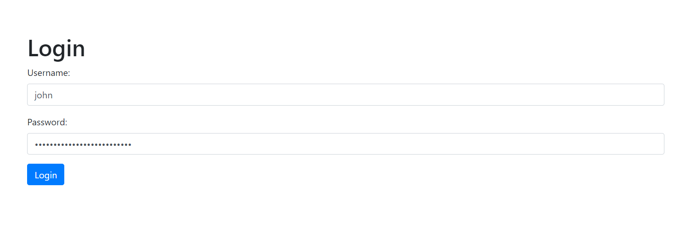
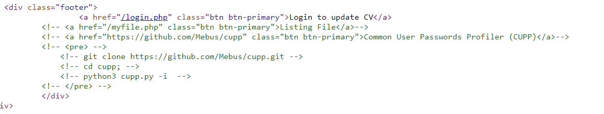
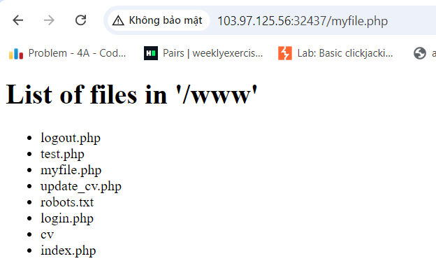
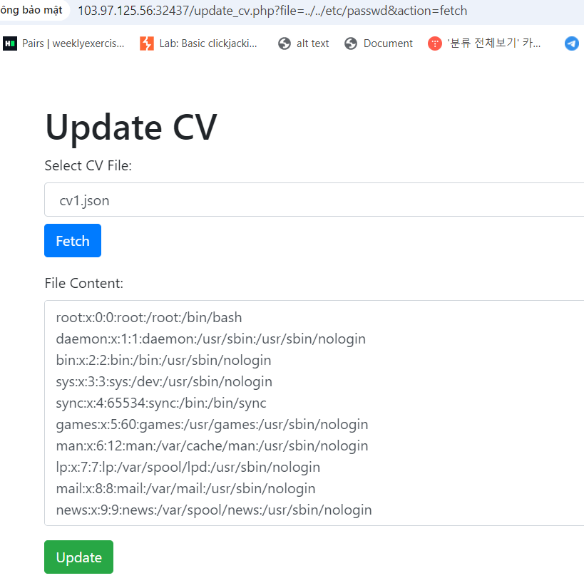
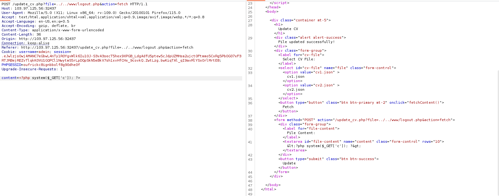
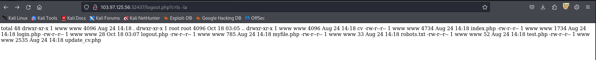
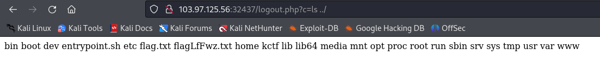
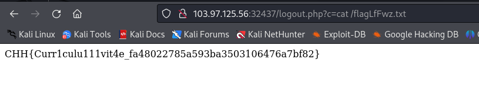

# solution

This challenge is very hard for me and it requires a lot to solve. Lets start.
<br>
First of all, i thought this challenge is some types of SQLI, but when i test it by intruder, nothing show interesting. So i try to read the page source to find something can help me. And i see this on main page.
<br>
<br>
Remember this dir, file can be access from /www

So maybe we need to use CUPP to guess John's password. I think you need to google and watch the information to understand more about this tool. Here is github link **https://github.com/Mebus/cupp** and youtube **https://www.youtube.com/watch?v=3ELSIa9xYts&t=85s**. For this challenge i use this command.

```
python3 cupp.py -i
```

After that, i have a file with a huge amount of passwords and just use burpsuite intruder to guess the password. And the password is **Doejohn9007**.

First step is done, after login i find a lfi vuln
<br>
Its cool, but we need to file the name of flag file and lfi can't do that. So i google searching and guess we need lfi to rce in some of php file. So i try will logout.php file in **/www**(you can also try will login.php or some others).
<br>
Then go to /logout.php on url.
<br>
<br>
<br>
