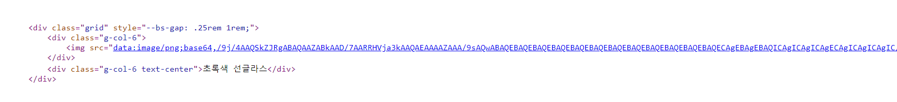
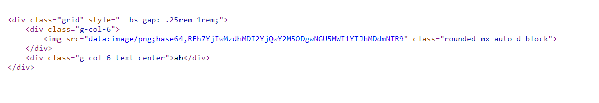
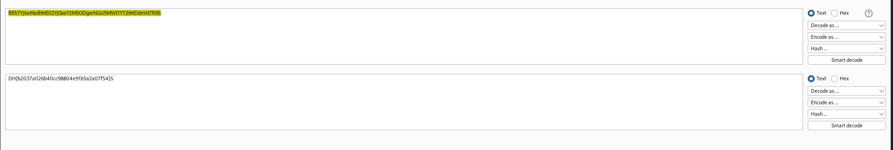

# solution

Firstly, i think this challenge related to os command injection cause i see the upload function but i have changed my mind when i read the page source
<br>
The server convert upload file into a image.

Hmm, the challenge's title show us the dir to get flag and this challenge also same to ssrf or lfi. But first take a quick look at source code.

```
@app.route('/request')
def url_request():
    url = request.args.get('url', '').lower()
    title = request.args.get('title', '')
    if url == '' or url.startswith("file://") or "flag" in url or title == '':
        return render_template('request.html')

    try:
        data = urlopen(url).read()
        mini_database.append({title: base64.b64encode(data).decode('utf-8')})
        return redirect(url_for('view'))
    except:
        return render_template("request.html")

@app.route('/upload', methods=['GET', 'POST'])
def upload():
    if request.method == 'POST':
        f = request.files['file']
        title = request.form.get('title', '')
        if not f or title == '':
            return render_template('upload.html')

        en_data = base64.b64encode(f.read()).decode('utf-8')
        mini_database.append({title: en_data})
        return redirect(url_for('view'))
    else:
        return render_template('upload.html')
```

Two functions but same function. In summary, there are two functions of uploading files and viewing image file display functions.

1. Uploading local files

2. Uploading external files

The vulnerability appear in here, i think im lucky when i search on hacktrick(LFI) i saw this **file:///etc/passwd**. So i make a quick search on chatgpt and i know that we can use file:/ or file:// or file:///.

```
if url == '' or url.startswith("file://") or "flag" in url or title == '':
        return render_template('request.html')
```

That is first thing we need to bypass, how we access to /flag.txt. **data = urlopen(url).read()** urlopen will URL Decoding. So i url encode all my payload but the page return me to request.html. So im try just encode one charecter.

```
file:/%66lag.txt
```

<br>
It seem works. Let me decode the content(use base64)
<br>
