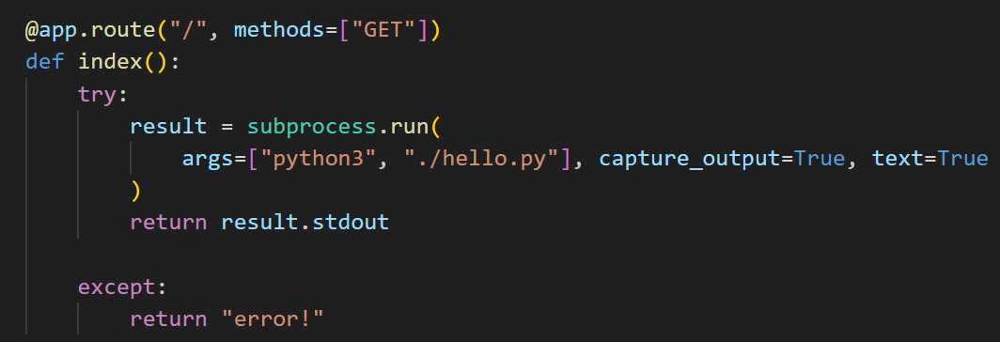
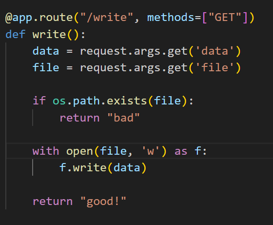
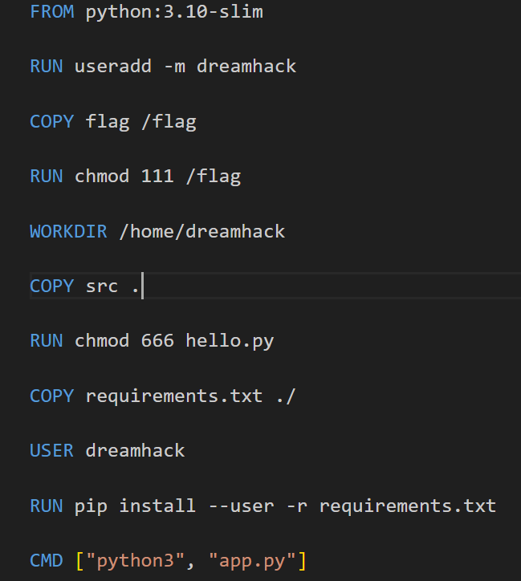
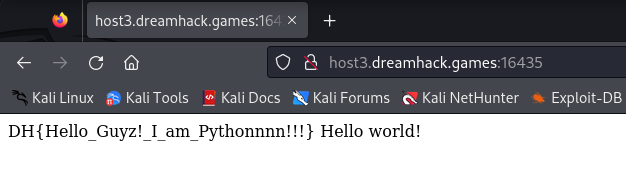

# solution

Wrong path: I try to bypass os.file.exist() funtion to insert content in hello.py, and i'm try quite hard for that. But after a long time, i did find anything interesting.
True path: After get a hints from a friends "in python, there is a module that start before python run main function", so after searching i found two modules are **usercustomize** and **sitecustomize** (the server will find usercustomize.py and sitecustomize.py in site-packages and start them). Let's look into main code in app.py

<br>
So my idea is, inject an malicious RCE in python at **/write** and return to main page **/**. So first i try with this payloads ( remember in this challenge we need to create exactly file name and store them in site-packages directory. Hear is full directory **/home/dreamhack/.local/lib/python3.10/site-packages/sitecustomize.py** )

```
http://host3.dreamhack.games:16435/?data=__import__('os').system('cat /flag')&file=/home/dreamhack/.local/lib/python3.10/site-packages/sitecustomize.py
```

<br>

It's return good then i return to the main page but still see any flag :)) . So i take a more careful look at dockerfile.
<br>
It's bad because **chmod 111 /flag** means that
i can just excute not read. So how to read flag file. I change the payload to execute the **/flag** and hopefully it works.

```
http://host3.dreamhack.games:16435/write?data=__import__('os').system('/flag')&file=/home/dreamhack/.local/lib/python3.10/site-packages/sitecustomize.py

```

and boom<br>

