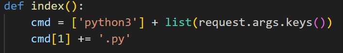
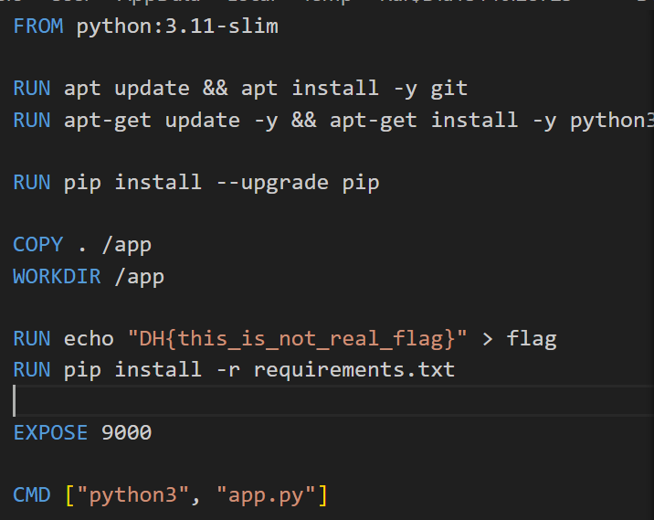
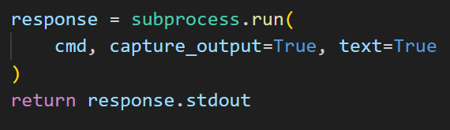

# solution

_wrong path at fist_: i think this challenge is cmd injection and spent a lot of time try to find sth interesting and useful for the flag

After get hints from a mate is turns out a RCE problems. So here is the path to solve. We definitely have app.py in server.

 
you see that _request.args.key()_ only take the key.This code means when we use Query Parameter, cmd get args.key that means when if we send this require _url:port/?app_ server understatnd and run _python3 app.py_. But very funny is that when we write Value on Parameter _url:port/?app=1234_ that also get **python3 app.py** so we knows that server is running our setence of arg.key. Next we take a look at this funtions

if we write our RCE code this code might runs in shell so how we exploit? we can run python code
and if you see DockerFile You can find flag dir is **/app/flag** Then we needs to find the modul which can approach the files and folder so I found a modul ! Base64! Base64 can approach to /file. Addtionally, filter bypass have '&' but we can use that on url with no problems (i don't know why :() ) and we have base64.py in **lib/python3.11/base64.py**. So what i want to do is, encode the content of /app/flag by **lib/python3.11/base64.py** and we wil get this flag encoded by base64. And finally we just decode to have real flag. this is url **http://host3.dreamhack.games:14200/?/lib/python3.11/base64&-e&/app/flag** (-e means encode) in shell it will become this **python3 /lib/python3.11/base64 -e /app/flag**. And also code python for this:

```
import requests
url = "Write Your URL"

payload = {
    "base64":1234, # We Don't see value so I write And ',' means &
    "-e":1234,
    "/app/flag":1234

}

r = requests.get(url, params=payload)

print(r.text)
```

flag = DH{there*is*/lib/python3.11/timeit.py}
