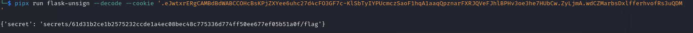

# solution

```
SECRETS_PATH = 'secrets/'
ALLOWED_CHARACTERS = string.ascii_letters + string.digits + '/'

app = Flask(__name__)
app.secret_key = os.urandom(32)

# create sample file
with open(f'{SECRETS_PATH}/sample', 'w') as f:
    f.write('Hello, world :)')

# create flag file
flag_dir = SECRETS_PATH + os.urandom(32).hex()
os.mkdir(flag_dir)
flag_path = flag_dir + '/flag'
with open('/flag', 'r') as f0, open(flag_path, 'w') as f1:
    f1.write(f0.read())


@app.route('/', methods=['GET'])
def get_index():
    # safely save the secret into session data
    session['secret'] = flag_path

    # provide file read functionality
    path = request.args.get('path')
    if not isinstance(path, str) or path == '':
        return render_template('index.html', msg='input the path!')

    if any(ch not in ALLOWED_CHARACTERS for ch in path):
        return render_template('index.html', msg='invalid path!')

    full_path = f'./{SECRETS_PATH}{path}'
    if not os.path.isfile(full_path):
        return render_template('index.html', msg='invalid path!')

    try:
        with open(full_path, 'r') as f:
            return render_template('index.html', msg=f.read())
    except:
        abort(500)
```

Take a look at source code, we need to know the path to read the flag (of course we dont bruce force). I see that the session will show us the right path if we can decode session.

```
.eJwtxrERgCAMBdBdWABCCOHcBsKPjZXYee6uhc27d4cFO3GF7c-KlSbTyIYPUcmczSaoF1hqA1aaqQpznarFXRJQVeFJhlBPHv3oe3he7HUbCw.ZyLjmA.wdCZMarbsDxlfferhvofRs3uQDM
```

Its not jwt, but refer to my experience, is maybe flask cookie (i dont know i call it right). So to decode the session, we need download this tool.

1. sudo apt install pipx
2. pipx install flask-unsign
3. pinx run flask-unsign **payload**

You can add the path in bash to make it shorter but I'm lazy so please just chatgpt for me. Here is the payload to decode cookie session

```
pipx run flask-unsign --decode --cookie '.eJwtxrERgCAMBdBdWABCCOHcBsKPjZXYee6uhc27d4cFO3GF7c-KlSbTyIYPUcmczSaoF1hqA1aaqQpznarFXRJQVeFJhlBPHv3oe3he7HUbCw.ZyLjmA.wdCZMarbsDxlfferhvofRs3uQDM
'
```

<br>
So just put this path to submit field to get flag. Good luck.
