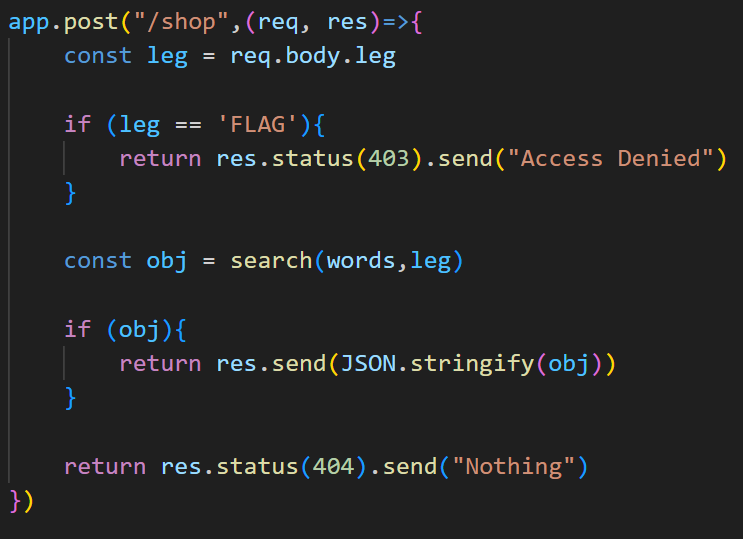
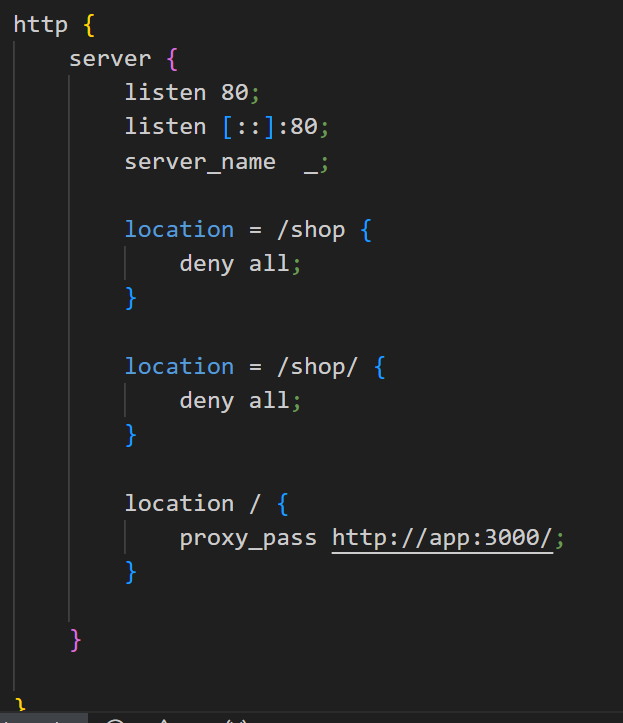

# solution

You need to focus on 2 things on source code.

we need post a request in /shop url with data "leg=flag" but how. Easily change the url from **/shop** to **/Shop** (an upper 'S'). And just write **leg=flag** we will bypass all the filter. And you will get the flag
