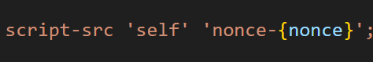
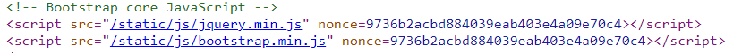
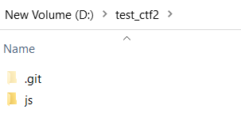
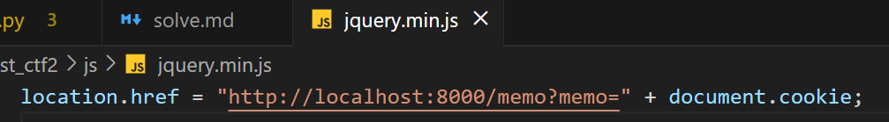
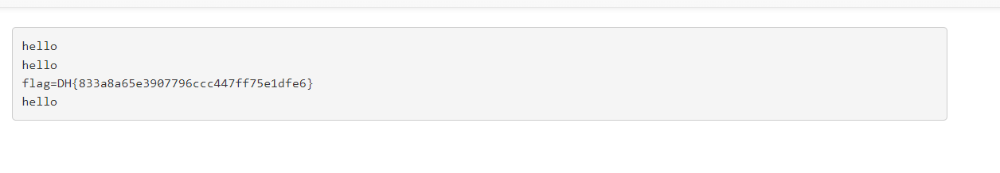

# solution

This challenge is challenging to me, if i dont get a hints from comment and a buddy i think i cannot solve this one. First let a look a this code.
<br>
Everything is similiar to **csp-bypass** but except this part. Now i need nonce's value to create **script**. Definitely we are not going to brute force it. I try some payload from hacktrick but still not find sth helpful. <br>
After that, i ask for hints and i know that we can
fool the system using our **/static/js/jquery.min.js** link. Cause that link have their own nonce's value so we can take advance of them to do what we want.
<br>
And we will use the **&lt;base&gt;** tag. <br>
The idea for this challenge is put a malicious &lt;base&gt; in /flag then retrieve the flag.
First, you need to make public url, and here is how to do it.

1. create a folder like this
   <br>
   in /js. You create a js file name jquery.min.js (or boopstrap.min.js ) with content.
   <br>

2. watch this video about how to create a github page: **https://www.youtube.com/watch?v=e5AwNU3Y2es&t=182s**

3. Next you create a repository with a name **static** (this is very important). Cause base tag doesn't affect absolute paths (those starting with a /); it only affects relative paths.
   If link starts with / they r not refer base full href(if href is aaa.com/path/to/path, they are referring only aaa.com).

4. Next you will create a payload, you change inside href by your domain

```
<base href="https://github.com/dbaothang">
```

5. get the flag
   <br>
