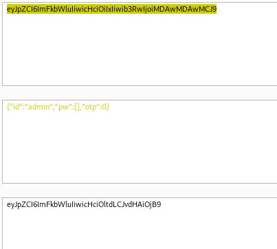
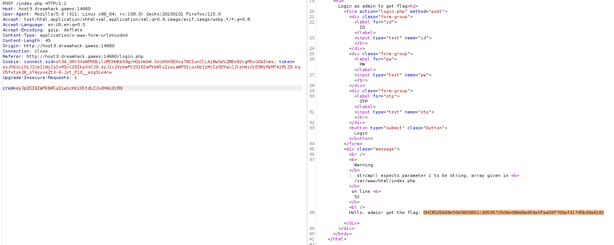

# solution

we should focus on this source code:

```
<form id="redir" action="index.php" method="post">
    <?php
    $a = array();
    foreach ($_POST as $k => $v) {
        $a[$k] = $v;
    }

    $j = json_encode($a);
    echo '<input type="hidden" name="cred" value="' . base64_encode($j) . '">';
    ?>
</form>
```

<br>
and
<br>

```
if ($cred['otp'] != $GLOBALS['otp']) {
        echo "OTP fail";
        return;
    }

    if (!strcmp($cred['pw'], $GLOBALS['admin_pw'])) {
        require_once('flag.php');
        echo "Hello, admin! get the flag: " . $flag;
        return;
    }
```

definitely, we can not guess the otp code and admin_password. So is there any way to bypass those 2 fields? My answer is yes. You can see it in here **https://book.hacktricks.xyz/network-services-pentesting/pentesting-web/php-tricks-esp**. In php, there are some loose compared so you can bypass this comparation by some trick:

 <br>

So we will put 0 and an array into otp and admin_passwd each. But not direct in the website. We use burp suite for that.
<br>
You copy cred value, then change it and copy the new one value. Send it again and you will receive flag.

