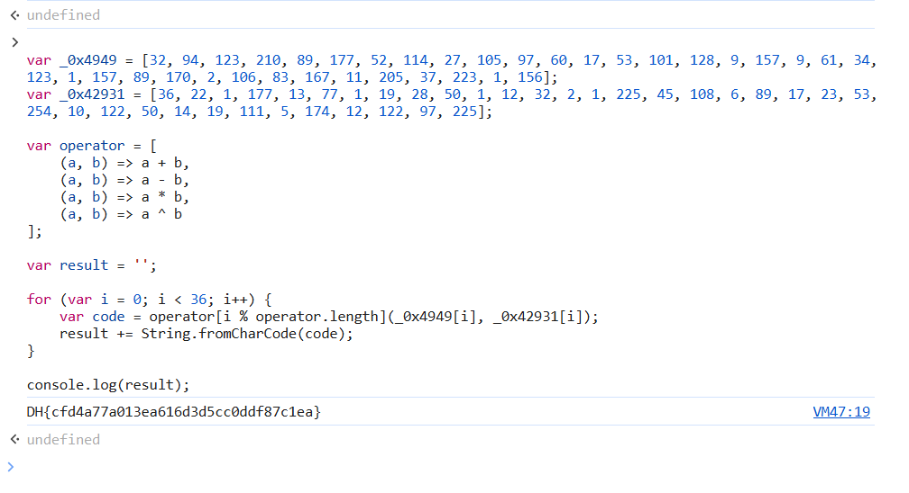

# solution

This challen is "fun". The answer is not far away but very close, but first take a look at the source code (I asked chatgpt and this is a more visible and "optimized" version of the code according to chatgpt)

```
function main() {
    var words = ['2XStRDS', '1388249ruyIdZ', 'length', '23461saqTxt', '9966Ahatiq',
                 '1824773xMtSgK', '1918853csBQfH', '175TzWLTY', 'flag',
                 'getElementById', '94hQzdTH', 'NOP !', '11sVVyAj',
                 '37594TRDRWW', 'charCodeAt', '296569AQCpHt', 'fromCharCode', '1aqTvAU'];

    var decodeIndex = function(index, offset) {
        index = index - 0x175;
        return words[index];
    };

    var getString = decodeIndex;

    (function(wordsArray, targetValue) {
        while (true) {
            try {
                var calculatedValue = -parseInt(getString(0x17f)) + parseInt(getString(0x180)) * -parseInt(getString(0x179))
                                      + -parseInt(getString(0x181)) * -parseInt(getString(0x17e))
                                      + -parseInt(getString(0x17b)) + -parseInt(getString(0x177)) * -parseInt(getString(0x17a))
                                      + -parseInt(getString(0x17d)) * -parseInt(getString(0x186))
                                      + -parseInt(getString(0x175)) * -parseInt(getString(0x184));

                if (calculatedValue === targetValue) break;
                else wordsArray.push(wordsArray.shift());
            } catch (error) {
                wordsArray.push(wordsArray.shift());
            }
        }
    })(words, 0xf3764);

    var flag = document[getString(0x183)](getString(0x182)).value;

    // Mảng các giá trị số, đã chuyển đổi hex sang thập phân
    var values1 = [32, 94, 123, 210, 89, 177, 52, 114, 27, 105, 97, 60, 17, 53, 101, 128, 9, 157, 9, 61, 34, 123, 1, 157, 89, 170, 2, 106, 83, 167, 11, 205, 37, 223, 1, 156];
    var values2 = [36, 22, 1, 177, 13, 77, 1, 19, 28, 50, 1, 12, 32, 2, 1, 225, 45, 108, 6, 89, 17, 23, 53, 254, 10, 122, 50, 14, 19, 111, 5, 174, 12, 122, 97, 225];

    var operators = [
        (a, b) => a + b,
        (a, b) => a - b,
        (a, b) => a * b,
        (a, b) => a ^ b
    ];

    if (flag.length !== 36) {
        text2img(getString(0x185));
        return;
    }

    for (var i = 0; i < flag.length; i++) {
        var charCode = flag.charCodeAt(i);
        var expectedCode = operators[i % operators.length](values1[i], values2[i]);

        if (charCode !== expectedCode) {
            text2img(getString(0x185));
            return;
        }
    }

    text2img(flag);
}

```

This is definitely not the cleanest, most complete code, but consider it a challenge if you want to understand the code. But this is what we need to pay attention to.

```
if (flag.length !== 36) {
        text2img(getString(0x185));
        return;
    }
for (var i = 0; i < flag.length; i++) {
        var charCode = flag.charCodeAt(i);
        var expectedCode = operators[i % operators.length](values1[i], values2[i]);

        if (charCode !== expectedCode) {
            text2img(getString(0x185));
            return;
        }
    }

    text2img(flag);
```

We can guess that the flag actually has 36 characters and how the flag characters are hinted to us through this command **var expectedCode = operators[i % operators.length](values1[i], values2[i]);**

So we can write a function to run from 1 to character 36 (convert ascii codes to char). Here is full of my payload

```
var _0x4949 = [32, 94, 123, 210, 89, 177, 52, 114, 27, 105, 97, 60, 17, 53, 101, 128, 9, 157, 9, 61, 34, 123, 1, 157, 89, 170, 2, 106, 83, 167, 11, 205, 37, 223, 1, 156];
var _0x42931 = [36, 22, 1, 177, 13, 77, 1, 19, 28, 50, 1, 12, 32, 2, 1, 225, 45, 108, 6, 89, 17, 23, 53, 254, 10, 122, 50, 14, 19, 111, 5, 174, 12, 122, 97, 225];

var operator = [
    (a, b) => a + b,
    (a, b) => a - b,
    (a, b) => a * b,
    (a, b) => a ^ b
];

var result = '';

for (var i = 0; i < 36; i++) {
    var code = operator[i % operator.length](_0x4949[i], _0x42931[i]);
    result += String.fromCharCode(code);
}

console.log(result);
```

<br>
