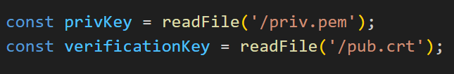
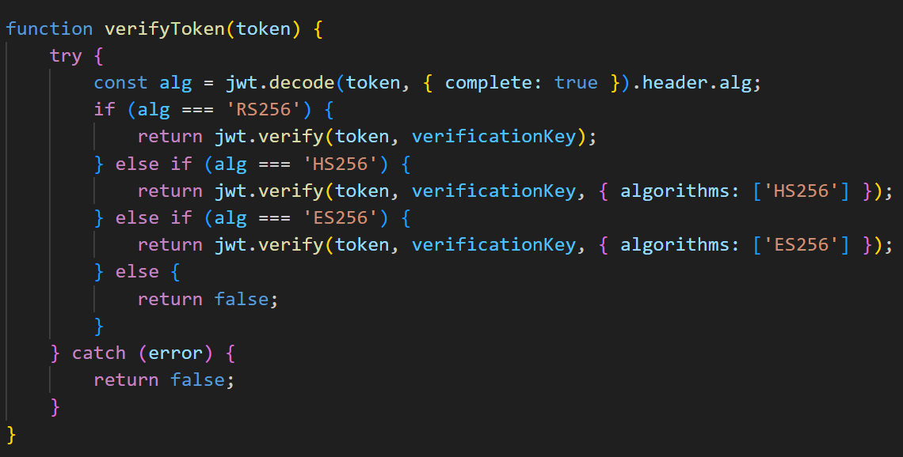

# thought to solve

first you see this on source code
 

i see two key for sign and decode, first i try to approach to 2 url and i have been blocked by server. Next i see this, and an idea appears to me
incidentally
 
If we somehow can find public key we can tamper an jwt code to get the flag. I don't have a lot of time, but you can see an example from this youtube link, i think it's 99% alike this challenge
https://www.youtube.com/watch?v=4roTwhGSWZY
