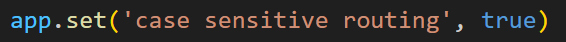
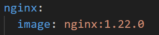
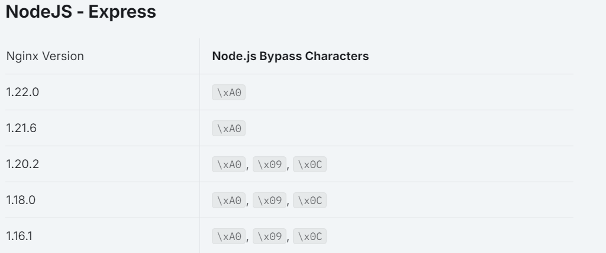
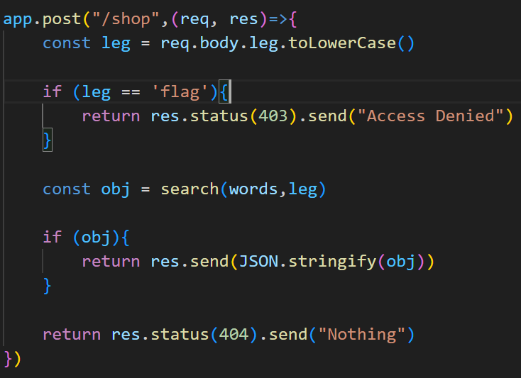
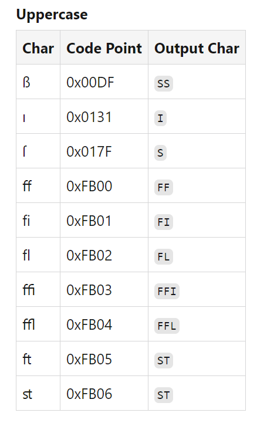
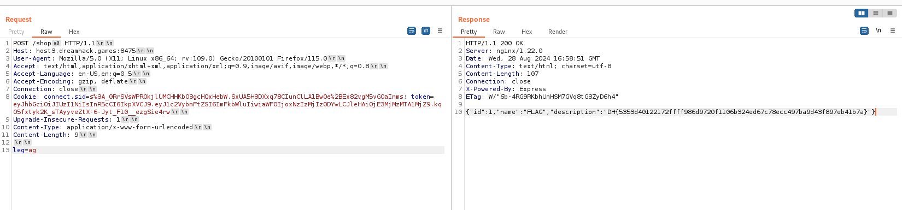

# solution

this challenge is quite similar to baby-case challenge but it has two things different make the challenge more hard. You should look careful in detail:

 

in first picture it's mean that the server will handle different rely on the char. upper or lower case will be handle like two seperate urls. /shop and /Shop are unlike. So how to bypass it. Well after get some hints from discord, i found this
 
and how to use it here https://www.youtube.com/watch?v=sgs3s5oTfz8
 
summary, the sever (nodejs) will ignore **\xA0** but the nginx considers them as the part of the url so nginx not ban it and the server will remove and access to /shop resource. Next step is how to get the flag:

 

we need someway display the word "flag" but how? after searching a lot i found this interesting page https://dev.to/jagracey/hacking-github-s-auth-with-unicode-s-turkish-dotless-i-460n
 
so we can us"flag" to bypass the filter and hu-ray i get the flag.
 

# preferences

https://dev.to/jagracey/hacking-github-s-auth-with-unicode-s-turkish-dotless-i-460n
https://blog.devsecopsguides.com/attacking-nginx
https://book.hacktricks.xyz/pentesting-web/proxy-waf-protections-bypass
