# solution_web (cause challenges is closed so im just show my way how to solve a challenge and i will use image for the chal that i dont remember name)

## 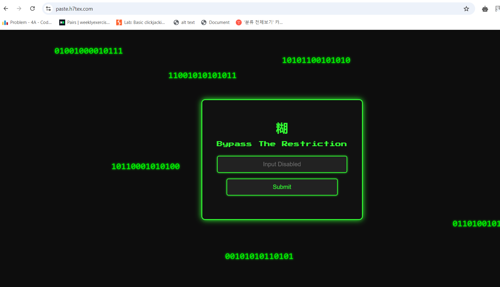<br>

First i check the source code, and i saw a **/script.js** i click on that link and this code appeared

```
const _0x704f72=_0x1bd5;function _0x1bd5(_0x2047f9,_0x357546){const _0xe16b22=_0xe16b();return _0x1bd5=function(_0x1bd527,_0x485649){_0x1bd527=_0x1bd527-0xc4;let _0x5b1899=_0xe16b22[_0x1bd527];return _0x5b1899;},_0x1bd5(_0x2047f9,_0x357546);}function _0xe16b(){const _0x4c3e23=['1324128AFJEVv','7068GqiGjD','challengeInput','2125DmXkHA','result','textContent','value','POST','5588288xDHxaF','bypass123','then','addEventListener','getElementById','/submit?input=','Flag:\x20','error','1026jodAtA','393500Fwnrwo','paste','793504lbHmgC','32613VrGzuS','flag','801iQqFPw','success','keydown','965970xJmNwA'];_0xe16b=function(){return _0x4c3e23;};return _0xe16b();}(function(_0x12ee8f,_0x15ae77){const _0x1e8539=_0x1bd5,_0x29eb23=_0x12ee8f();while(!![]){try{const _0x122b1f=-parseInt(_0x1e8539(0xc7))/0x1+-parseInt(_0x1e8539(0xcd))/0x2+parseInt(_0x1e8539(0xce))/0x3+parseInt(_0x1e8539(0xcf))/0x4*(-parseInt(_0x1e8539(0xd1))/0x5)+parseInt(_0x1e8539(0xc4))/0x6*(-parseInt(_0x1e8539(0xc8))/0x7)+-parseInt(_0x1e8539(0xd6))/0x8+parseInt(_0x1e8539(0xca))/0x9*(parseInt(_0x1e8539(0xc5))/0xa);if(_0x122b1f===_0x15ae77)break;else _0x29eb23['push'](_0x29eb23['shift']());}catch(_0x4a7e8a){_0x29eb23['push'](_0x29eb23['shift']());}}}(_0xe16b,0x66be5));function submitInput(){const _0x138950=_0x1bd5,_0x2f7956=document['getElementById'](_0x138950(0xd0))[_0x138950(0xd4)],_0x52b4bc=_0x138950(0xd7);fetch(_0x138950(0xdb)+encodeURIComponent(_0x2f7956),{'method':_0x138950(0xd5)})[_0x138950(0xd8)](_0x101da1=>_0x101da1['json']())[_0x138950(0xd8)](_0x5c2193=>{const _0x239188=_0x138950,_0xae2c45=document[_0x239188(0xda)](_0x239188(0xd2));_0x5c2193[_0x239188(0xcb)]?_0xae2c45[_0x239188(0xd3)]=_0x239188(0xdc)+_0x5c2193[_0x239188(0xc9)]:_0xae2c45[_0x239188(0xd3)]=_0x5c2193['message'];})['catch'](_0x3c7f8d=>{const _0x84ca33=_0x138950;console[_0x84ca33(0xdd)]('Error:',_0x3c7f8d);});}document['getElementById'](_0x704f72(0xd0))[_0x704f72(0xd9)](_0x704f72(0xc6),_0x2860a8=>_0x2860a8['preventDefault']()),document[_0x704f72(0xda)](_0x704f72(0xd0))[_0x704f72(0xd9)](_0x704f72(0xcc),_0x357fbf=>_0x357fbf['preventDefault']());
```

Hmm its maybe some kinds of js obfuscation so i come to JavaScript Deobfuscator online to deobfuscate the code.

```
function submitInput() {
  const _0x2f7956 = document.getElementById("challengeInput").value;
  fetch("/submit?input=" + encodeURIComponent(_0x2f7956), {
    'method': "POST"
  }).then(_0x101da1 => _0x101da1.json()).then(_0x5c2193 => {
    const _0xae2c45 = document.getElementById("result");
    if (_0x5c2193.success) {
      _0xae2c45.textContent = "Flag: " + _0x5c2193.flag;
    } else {
      _0xae2c45.textContent = _0x5c2193.message;
    }
  })['catch'](_0x3c7f8d => {
    console.error('Error:', _0x3c7f8d);
  });
}
document.getElementById("challengeInput").addEventListener("paste", _0x2860a8 => _0x2860a8.preventDefault());
document.getElementById("challengeInput").addEventListener("keydown", _0x357fbf => _0x357fbf.preventDefault());
1;
```

i think you should focus on this code

```
const _0x2f7956 = document.getElementById("challengeInput").value;
  fetch("/submit?input=" + encodeURIComponent(_0x2f7956), {
    'method': "POST"
  }).then(_0x101da1 => _0x101da1.json()).then(_0x5c2193 => {
    const _0xae2c45 = document.getElementById("result");
```

i think if we can put value into **challengeInput** maybe we can get flag. But how to put sth in that field. You can use console (f12). And the value we will put is **bypass123** cause the code shows us sth like the server check the input equal to bypass123 then we get the flag.
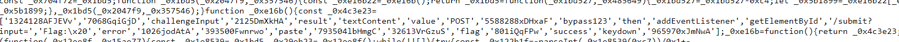<br>
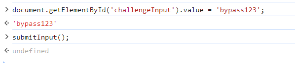<br>
enter 2 lines of console code respectively. And we get the flag.
<br>

## WEB-newsbreak

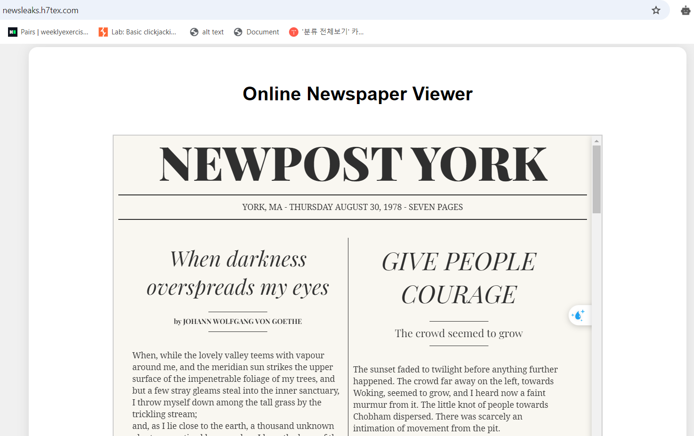<br>

we see a site like this, after scrolling a lots, i dont see anything interesting. So again i view source code and i see this url path

```
<iframe id="newspaperFrame" src="view.php?file=newspaper1.html"></iframe>
```

From my experience, i think i can lfi in this input so im try.
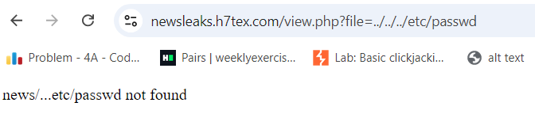<br>
Hmm, the server remove one dot **.** and one **/**. So i change my payload become

```
https://newsleaks.h7tex.com/view.php?file=...//...//...//...//etc/passwd
```

and get the flag
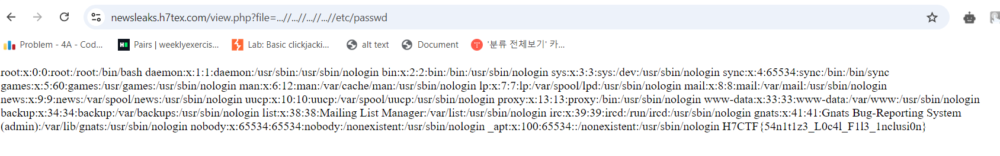<br>

## Paper Chase

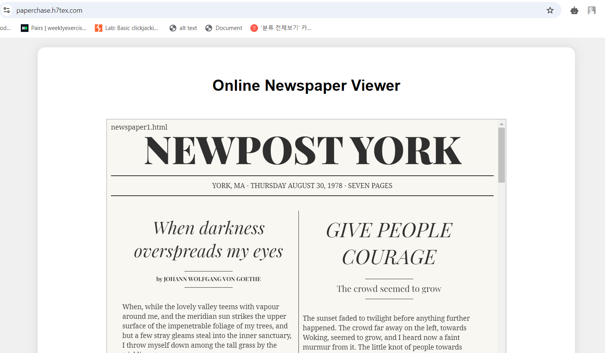<br>

another challenge related to news. Still see the url and im try to guess what they advanced to server.
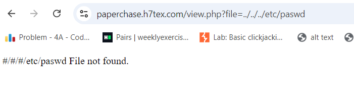<br>
They turn 2 dots become #. Hmm i try double encoding but still not bypass the filter. So i go to **Hacktrick** and i see this (i try a lots of payloads in hacktrick but to save time, I will go straight to the main payload.)
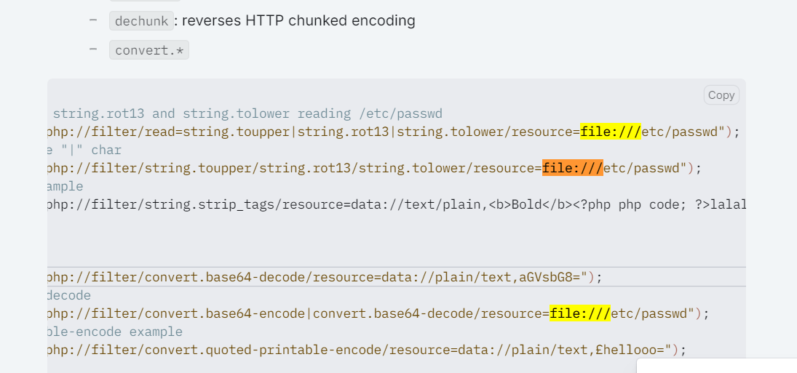<br>
So im try this payload and get the flag.
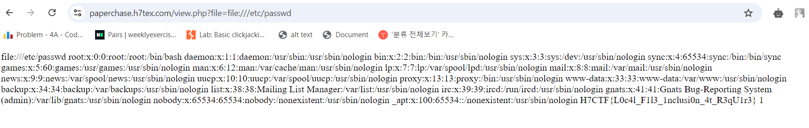<br>

## code breaker

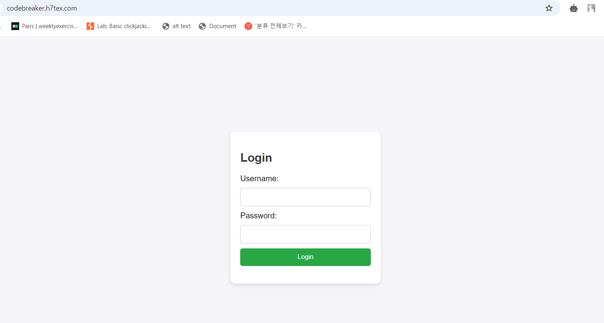<br>
You have a site like this. Im try sql payloads but this challenge isnt sqlI. So im try the username and password that provided by the organizers. Lets see we can find sth.

Im log in and try this url
<br>
Hmm, maybe there is a mechanism to determine if you are an admin.
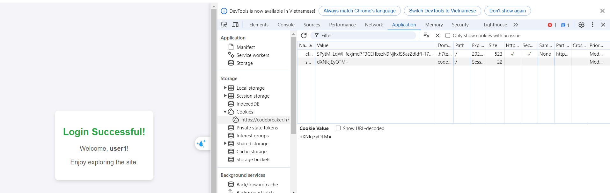<br>
Its look like base64 encode. I decode it and get this value **user1293**. I try log in 3 4 times again and watch this cookie. i see that cookie is Base64 encode of user and 4 random digits. So maybe the cookie of admin is base64encode(admin+ 4 random digits). Lets try out.
<br>
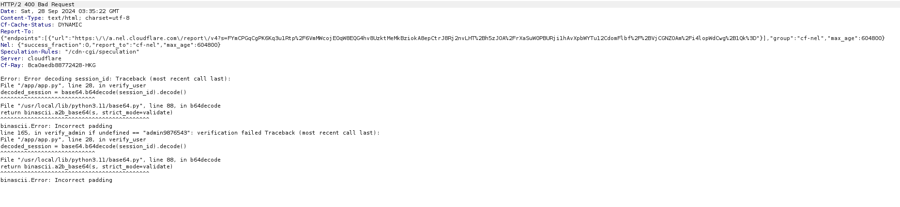<br>
Hmm an error, but its reveals the cookie to admin. So i encode **admin9876543**. And you get a flag
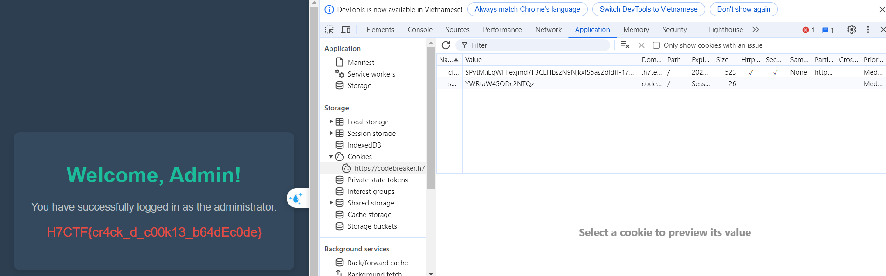<br>
