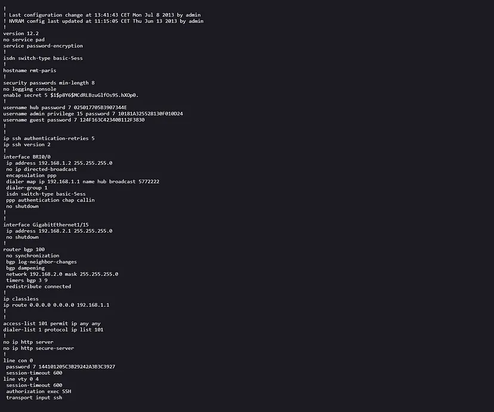
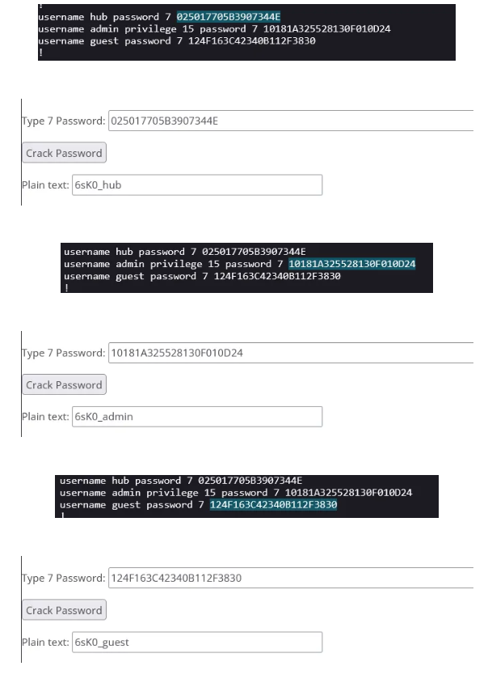

# solution

Open file you see this
 
Cisco has built-in commands to protect Config, but did you know it can be unlocked?

The Root me platform has an exercise titled Determining the Config Password of Cisco Devices!

Because the password encryption method in Cisco is reversible, let’s take a look at a short section of Config:

hostname rmt-paris
!
security passwords min-length 8
no logging console
enable secret 5 $1$p8Y6$MCdRLBzuGlfOs9S.hXOp0.
!
username hub password 7 025017705B3907344E
username admin privilege 15 password 7 10181A325528130F010D24
username guest password 7 124F163C42340B112F3830

We can throw the values ​​behind the three passwords to the online decryption platform and take a look.
https://www.ifm.net.nz/cookbooks/passwordcracker.html
 
The result is as follows:

hub:6sK0_hub
admin:6sK0_admin
guest:6sK0_guest

So according to the order, hub solves hub, and the guessed answer should be

got it !!!!!!!!!!!!!!!!

password : enable:6sK0_enable
