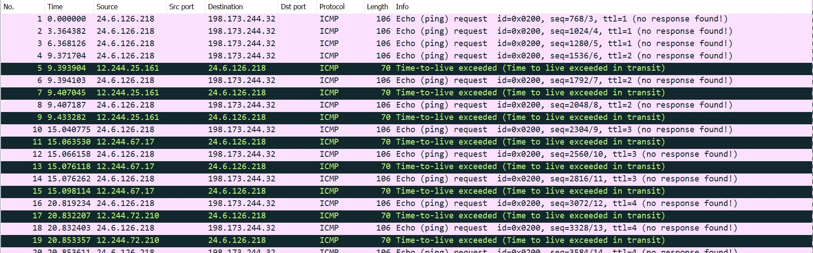
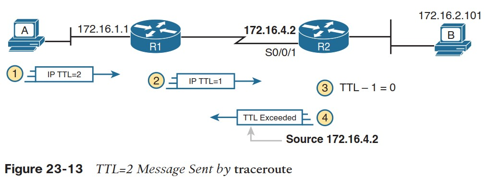
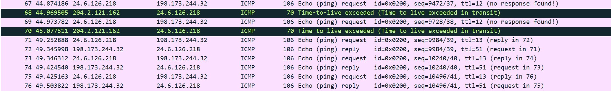

# solution

Open the file we see this:
 
Challenge details did not provide source/destination host IPs so let’s deduce it from the log. We assume at the outset the source is 24.6.126.218 while the remote host is 192.173.244.32 We also see a bunch of TTL-exceeded replies starting from 12.244.25.161 for packet TTL=2, 12.244.72.210 to 204.2.121.162 for TTL=12.
 
Traceroute starts without knowing how far away the remote host is with TTL=1. Each time the TTL is exceeded for each ICMP packet, we get a replying packet stating TTL exceeded. This is exactly what we see in the log capture. The source of these “TTL exceeded” packets varies but the destination is always 24.6.126.218, which we deduce must be our source host. Secondly note that 24.6.126.218 is always present in either the source/destination. This strongly suggests the Wireshark application is installed on the this host, since it captures all packets outgoing or incoming on this interface.

Great. We identified the source and destination hosts. Now what is the distance to the destination host? Note that we will keep getting “TTL exceeded” messages until the TTL of the originating packet increases to the point we stop getting it. Scrolling down we see this stops at TTL=13.
 
