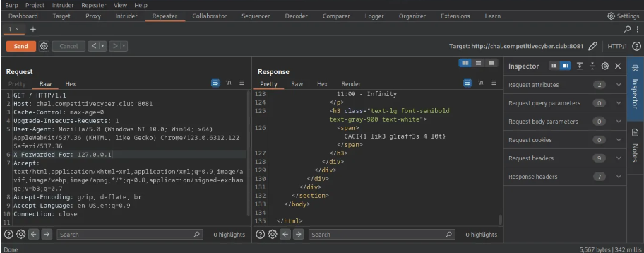

# solution

First of all, we will take a look at the UI, it seems like there is nothing special.

Looking at the source code, the point is in the php code below:

```
<?php
$allowed_ip = ['localhost', '127.0.0.1'];

if (isset($_SERVER['HTTP_X_FORWARDED_FOR']) && in_array($_SERVER['HTTP_X_FORWARDED_FOR'], $allowed_ip)) {
    $allowed = true;
} else {
    $allowed = false;
}

?>
```

These code lines above will use the HTTP header X-Forwarded-For to check if the client’s hostname is “localhost“, or the client’s ip addresss is 127.0.0.1, which means it belongs to the same internal network with the server. If that condition is met, the $allowed variable will be set to True, then we’ll get the flag.

Just modify the X-Forwarded-For Header to localhost or 127.0.0.1 to get the flag.
<br>
