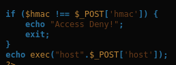
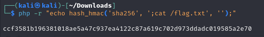
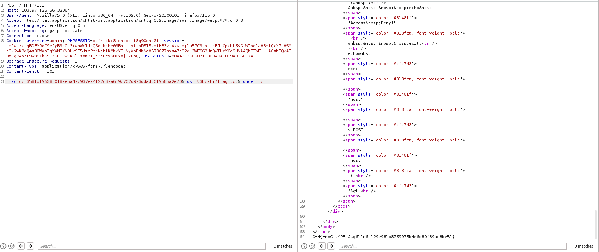

# solution

The main idea is find a way to bypass this if statement and inject a malicious cmd payload:
<br>

After searching, i find that in php

```
Understanding hash_hmac()
The function hash_hmac($algo, $data, $key) requires:

$algo: hash algorithm (e.g. "sha256")
$data: input data string (must be string)
$key: secret key (string)
If $data is not a string, PHP will do type juggling.

2. What happens when $data is an array?
When passing an array to hash_hmac() as follows:

php
Copy
Edit
$secret = hash_hmac('sha256', [], $secret);
PHP will try to cast $data (here [], i.e. an empty array) to a string. According to PHP's rules:

When casting an array to a string, it becomes "Array".
But hash_hmac() only accepts strings, so when encountering an array, PHP will warn an error and replace the value with an empty string ("").

For example:

php > echo $secret;
PHP Notice:  Undefined variable: secret in php shell code on line 1
php > $secret = hash_hmac('sha256', [], 'secret');
PHP Warning:  hash_hmac() expects parameter 2 to be string, array given in php shell code on line 1
php > echo $secret;
php >
```

So we just need to change nonce from string to array (by change like this: nonce[]). Then create a hmac with the payload you want to trigger:
<br>
And final payload:
<br>
