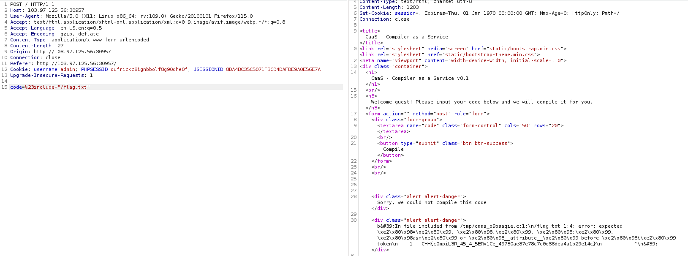

# Solution

This challenge is quite tricky for me. I know that i can get a flag by trigger flaw disclosure information but i dont know where to start. Then i think that i need to execute lfi by somehow. After searching about c, i know that we can include by type in **#include "abc.txt"** like this. Then i create a simple payload:

```
#include "/flag.txt"
```

<br>
