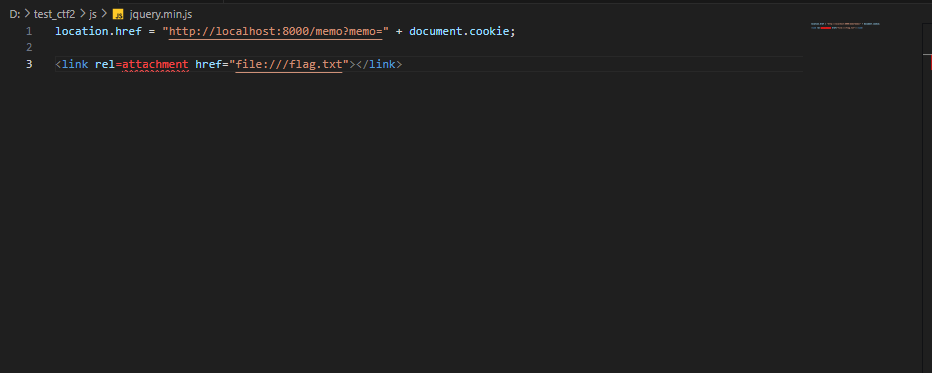
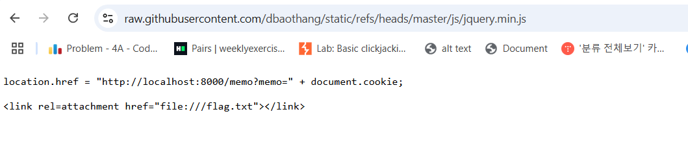
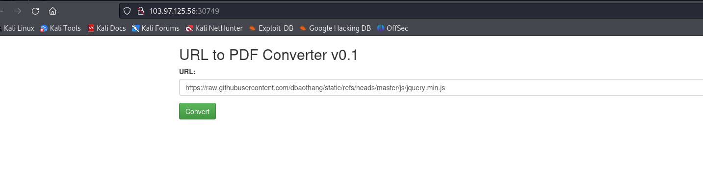
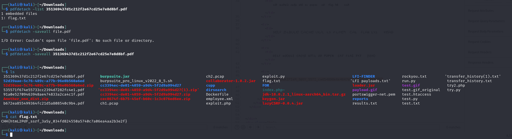

# solution

This challenge is pretty hard for me. I dont have any experience for this type of this one before. So let's google. You can find sth in here **https://ctftime.org/writeup/9839**. I guess this challenge maybe similiar to that one. So the idea is make a website have html that can access to local file (flag.txt).

You can try with method in that url (telp me if it works) but i do in different way (my friends hint for me hihi). Anothe link for the way i solved this lab **https://book.hacktricks.xyz/pentesting-web/xss-cross-site-scripting/server-side-xss-dynamic-pdf**

```
<link rel=attachment href="file:///flag.txt"></link>
```

That one above is my payload i used. To finish, just create a folder with a file include that payload
<br>
Dont care about the **location.he..** Im a lazy boy so i do 2 ctf challenges in one file. but you probably get the idea. Upload to your github, then copy (the url raw link)
<br>
<br>
You then have a .pdf file. Next use this tool **pdfdetach**. pdfdetach is a command line tool in Poppler Utils (a suite of PDF processing tools) used to extract attachments from a PDF file. Attachments in a PDF can be any type of file (e.g. image, text document, zip file, etc.) that the PDF creator has attached to the document. Because flag.txt file has been embedded into that pdf file.

```
sudo apt update
sudo apt install poppler-utils
```

That's how to download.
<br>
You use -list to find how many embedded files in .pdf file. Use -saveall to output all of that embedded file to your currently folder. Then just cat it.
