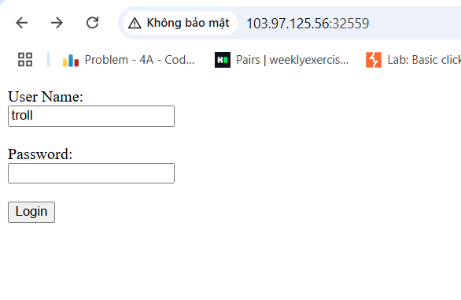

# solution

You have a page like this:
<br>
Lets inspect if we can find something useful for us.
<br>

Hmm, seem we have a php code here. To login the pass we put (after shad256 hashed) **==** "0". The vuln here is loose compare in php. You can search it on google, in this challenge you just know that 0=="0" return true. But how can we do that, after asked my friends i find a site
https://github.com/spaze/hashes/blob/master/sha256.md

Explain a bit more, that is 0e, for PHP, means 0 to the power, for example 0e3 is just the way to write 0 to the power of 3. So pow(0,n) still 0.
<br>
After login, we saw this. Definitely, we must upload a malicious php file. I upload .php file with content:

```
<?php system('cat /flag.txt'); ?>
```

Follow the file link and we have the flag.
<br>
