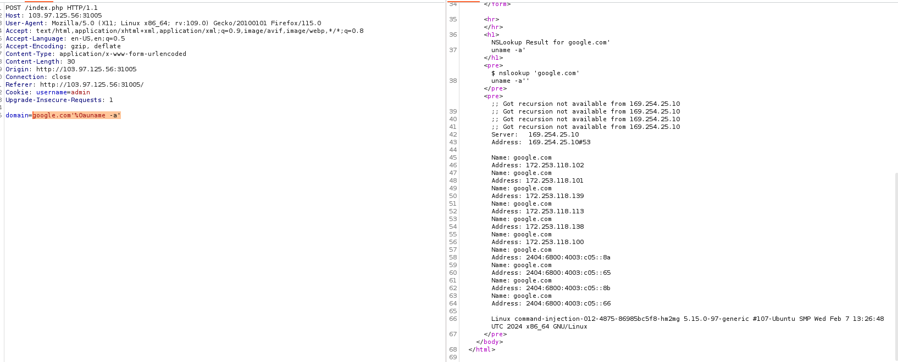
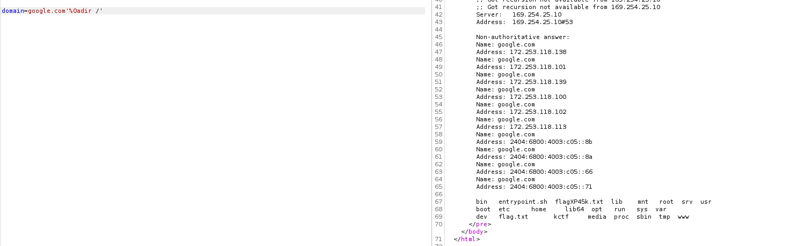

# solution

This challenge is quite trick to me. Its some kinds of cmdI. After bruteforce i guess the payload will be like

```
google.com'%0auname -a'
```

<br>

But the server filter **cat** and **ls** command. So we need to find atternative command. After searching i find **more** replace for **cat** and **dir /** replace for **ls**.
<br>

and you have the flag.

CHH{N5l00kupM00r3_9e8766307521750896bb2c1b70f07c1a}
