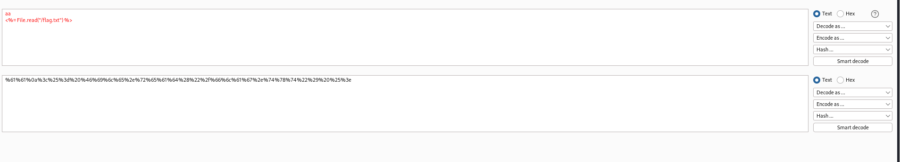
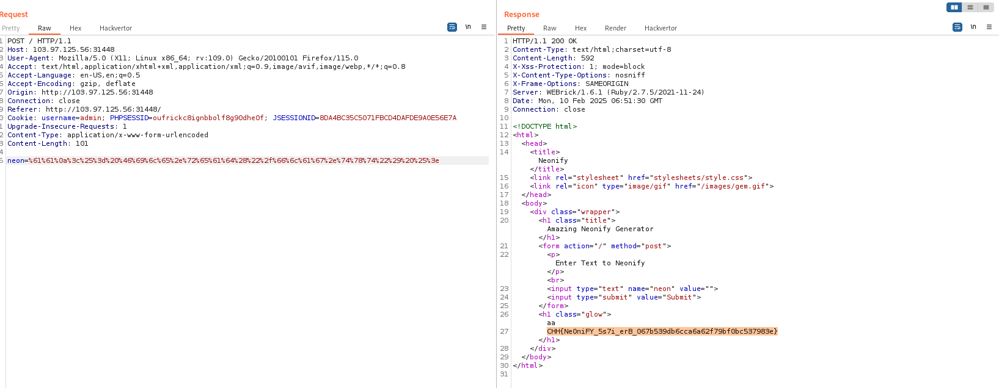

# solution

Look briefly, its definitely SSTI vuln but how to exploit. I try to manually test some payloads and is always show
 
After testing more carefully, i find that we can type only a-z,0-9 char else we will be filtered. So how to inject ssti payloads :??.
Luckily, in erb(Ruby) we can bypass regex checking mechanism as follows

**https://davidhamann.de/2022/05/14/bypassing-regular-expression-checks/**

So the ruby online check the first line for the regex and next lines we can enter anything we want. With that idea, i creat this payload(Url encode):

 
 
