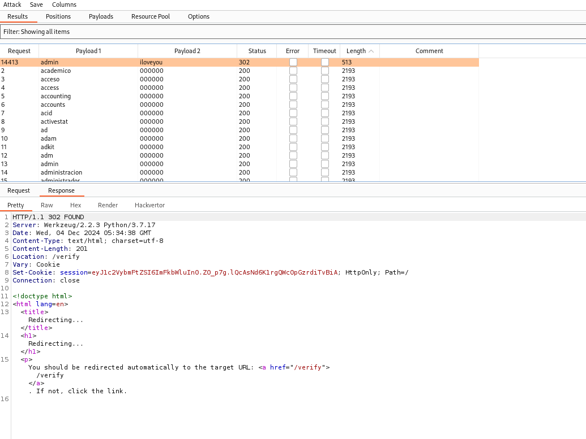
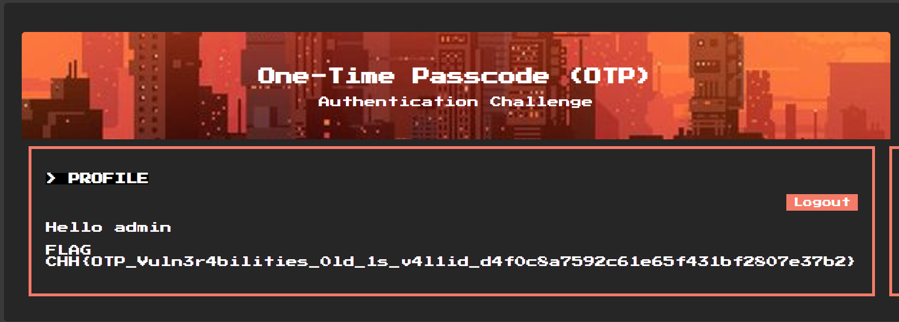

# solution

You have a username and password source code. The vuln is though you require a new OTP you still can access with 1022 (that is my old OTP code, it maybe different when you do the lab). The final step is to bruteforce to find the username and password.

I used burp suite intruder for that purpose:
 
 
