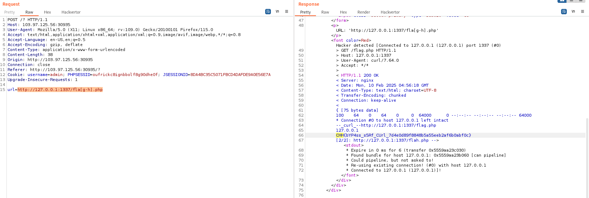

# solution

First of all, let take a look at source code:

```
// index.php
if (!empty($_POST['url']) && is_string($_POST['url'])){
  if(!filter_var($_POST['url'], FILTER_VALIDATE_URL) === false  && substr($_POST['url'],0,7) === "http://"){
    $url = strtolower(escapeshellarg($_POST['url']));
    $ret = `curl -v $url 2>&1`;
    echo "<p>URL: ".$url."</p>";
    if( !preg_match('/(\.localhost|%|flag)/is',$url,$matches) && !preg_match("/(Connected.*\(172\..*?\))/is",$ret,$matches)) {
      echo "<br /><pre>$ret</pre>";
    } else {
      echo "<font color=Red>Hacker detected [{$matches[1]}]!</font>";
    }
  } else {
    echo "<font color=Red>Invalid URL!</font>";
  }
}
-->

<!--
// flag.php
$ip = $_SERVER['REMOTE_ADDR'];
echo $ip."\n";
if($ip === '127.0.0.1' || $ip === '::1') echo "FLAG_HERE";
-->

```

Basically, you need to use SSRF to get the flag. You must access flag.php using the 127.0.0.1 IP address.

So how to bypass filter on index.php. We can use 127.0.0.1 instead of localhost. Then after searching and testing a while, i find that this system can read regex char like this **[g-h]**. So my payload for this challenge:

```
http://127.0.0.1:1337/fla[g-h].php
```

<br>
