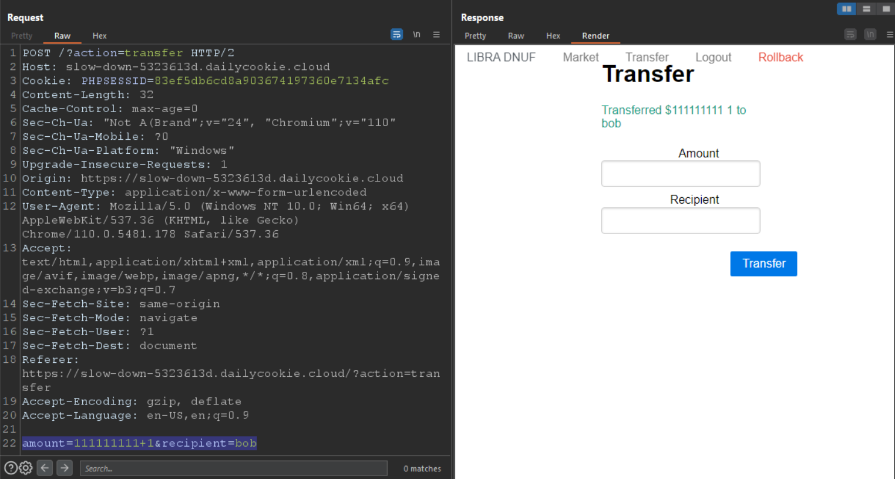
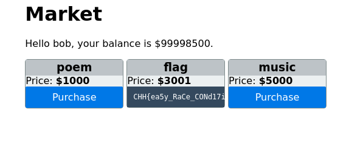

# solution

You sign up with alice:alice and bob:bob. Here i used alice:alice to transfer money to bob:bob.
Firstly, i thought its some kinds of business logic flaws, but its not working. Then i put something like 1000000+1 and 1000000-1. Luckily, its working
 
You then can but the flag in the bob's account.
 
Hmm, race-condition. I thought when i put the value such as **1000000+1** the server will treat it as two requests per time. Value **1** is accepted but the race window open and we can add **1000000** to the value.
If my thinking not right, please let share your thinking and we will discuss more.
