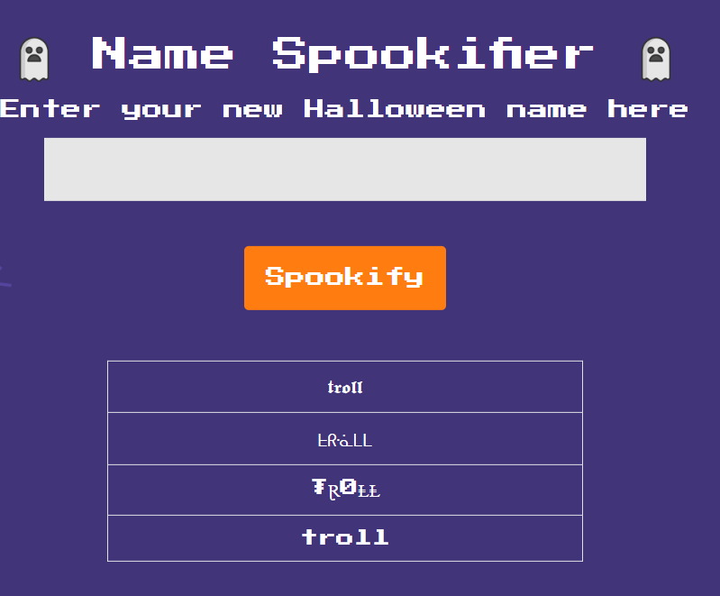
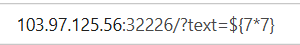
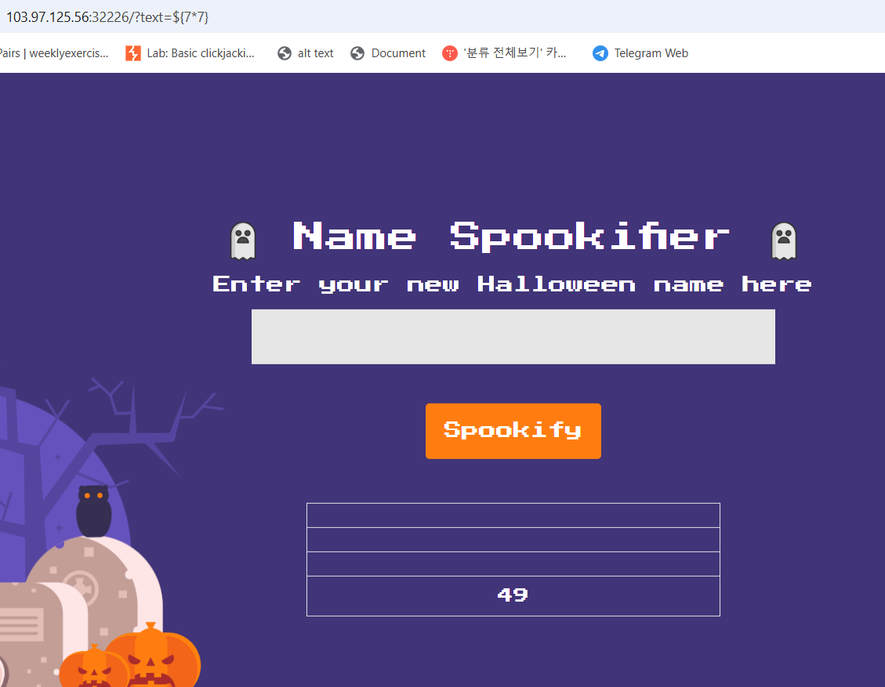
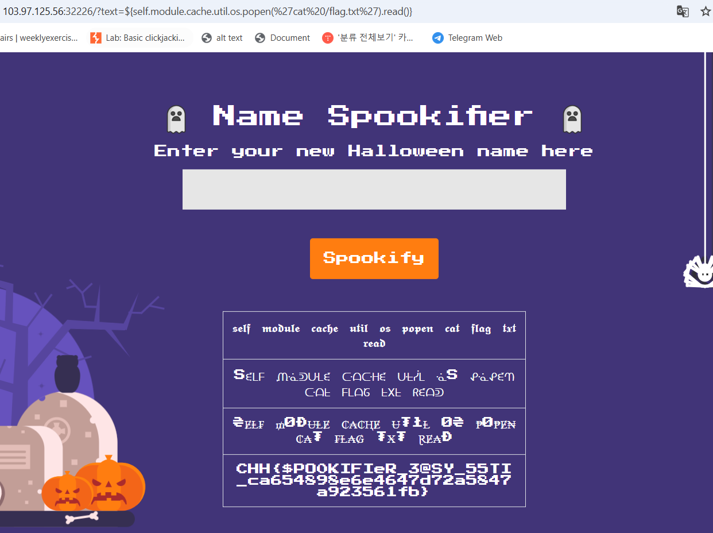

# solution

<br>
i put some random strings and i saw this, Hmm let see the url.
<br>
I try LFI, XSS, and finally i lucky trigger SSTI.
<br>
Then i find some payloads in hacktrick and chatgpt and google.

```
${self.module.cache.util.os.popen('cat%20/flag.txt').read()}
```

<br>
