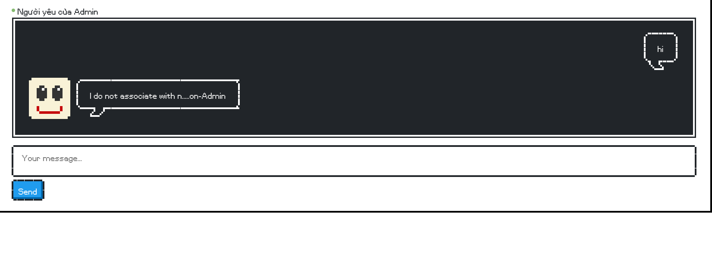
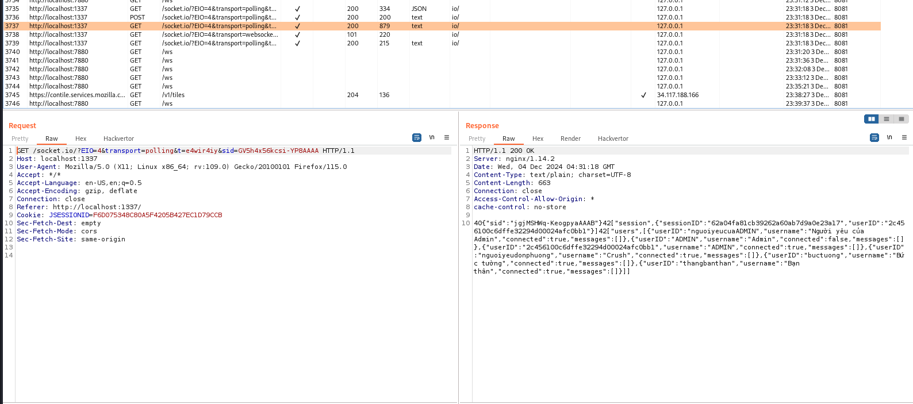
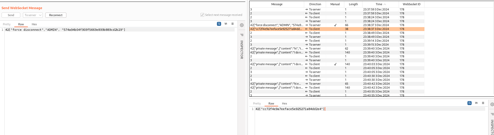
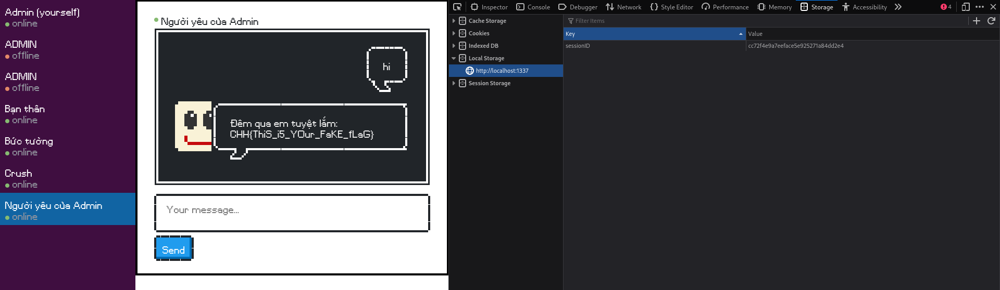

# solution

I cant access to the url, so i solve with docker run on my local (you can do the same like me to get the real flag). I think you need look at source code by yourself to more understand. Here, i only show you the part that i think is important to solve the lab. First run the lab.

```
bash docker-build.sh
```

This part of source code i think is important

```
socket.on("private message", ({ content, to }) => {
    const message = {
      content,
      from: socket.userID,
      to,
    };

    switch(to){
      case "thangbanthan":
        message.content = "T đang bận, 5p sau t trả lời. Sau 5p, k thấy trả lời thì xem lại tn này.";
        message.from = to;
        message.to = socket.userID

        socket.emit("private message", message);
        break;
      case "nguoiyeudonphuong":
        const cachcrushtraloi = ['uh','ok','um','seen','seen','seen','seen','seen','seen','seen','seen']
        var reg1 = /n\s*?g\s*?.\s*?.\s*?i\s*?y?\s*?.\s*?u/g
        var reg2 = /b\s*?.\s*?n\s*?g?\s*?.\s*?i/g
        message.content=cachcrushtraloi[Math.floor(Math.random() * cachcrushtraloi.length)];

        if(content.match(reg1)||content.match(reg2)){ "chê"; }
        message.from = to;
        message.to = socket.userID

        socket.emit("private message", message);
        break;
      case "nguoiyeucuaADMIN":
        if(socket.userID !== "ADMIN"){
          message.content="I do not associate with n.....on-Admin";
        }else{
          message.content="Đêm qua em tuyệt lắm: \n"+FLAG;
        }
        message.from = to;
        message.to = socket.userID
        socket.emit("private message", message);
        break;
      case "buctuong":
        break;
      default:
        socket.to(to).to(socket.userID).emit("private message", message);
        messageStore.saveMessage(message);
    }

  });

  // admin force any user to disconnect
  socket.on("force disconnect",async (userID,secretKey)=>{
    // check valid account
    if (secretKey !== "574a94b04f303f5663e833b883cd2b23"){
      socket.emit("This secret key is wrong.")
    }
    else{
    const targetSocket = await sessionStore.findSessionsByUserID(userID);
    const matchingSockets = await io.in(targetSocket.userID).allSockets();
    const isDisconnected = matchingSockets.size === 0;
    if (isDisconnected) {
      // notify other users
      socket.broadcast.emit("user disconnected", targetSocket.userID);
      // update the connection status of the session
      socket.emit(targetSocket.sessionID);
      sessionStore.saveSession(targetSocket.sessionID, {
        userID: targetSocket.userID,
        username:targetSocket.username,
        connected: false,
      });
    }};
  });
```

```
sessionStore.saveSession(socket.sessionID, {
    userID: socket.userID,
    username: socket.username,
    connected: true,
  });
```

So the sessionId store our information such as userId, username, ...and the admin's userId is **ADMIN**.

when i open the page, i type ADMIN and this page appear.

<br>

let mannual test something.

<br>

let turn on burp suite.
<br>
Pretty sure we have ADMIN. So my idea is to try steal the sessionId to tamper real admin. We will do that by **force disconnect**, and we also have secretKey. This function will show the session **socket.emit(targetSocket.sessionID);**

<br>
Good, know open inspect and change the sessionId in localstorage to the sessionId of real ADMIN.

<br>
