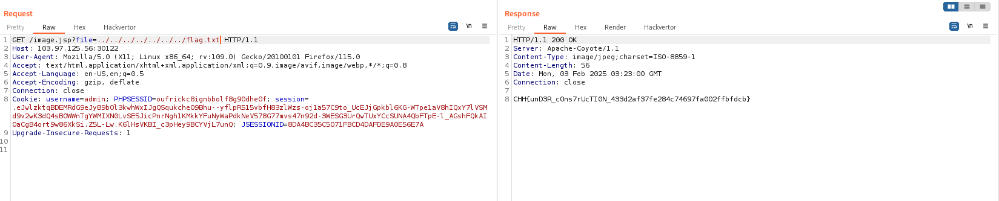

# solution

```
<%@ page trimDirectiveWhitespaces="true" %>
<%
String filepath = getServletContext().getRealPath("resources") + "/";
String _file = request.getParameter("file");

response.setContentType("image/jpeg");
try{
    java.io.FileInputStream fileInputStream = new java.io.FileInputStream(filepath + _file);
    int i;
    while ((i = fileInputStream.read()) != -1) {
        out.write(i);
    }
    fileInputStream.close();
}catch(Exception e){
    response.sendError(404, "Not Found !" );
}
%>
```

With my experient, its 100% lfi vuln. I try some basic payloads
<br>
