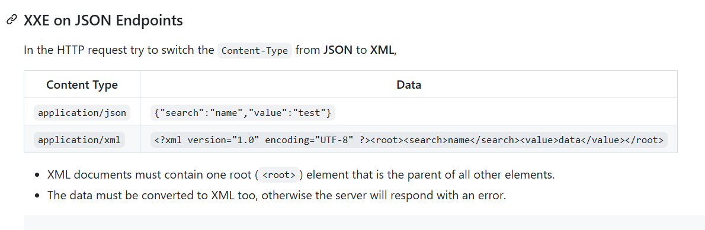

# solution

We have a hint in this chal's title
 
So the idea is change json data to xml data like this, and remember change data-type field:
 
Then i google and modify the xml a bit. Here is final payload
 
