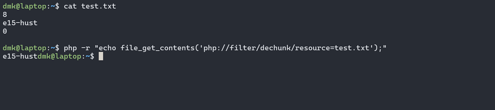
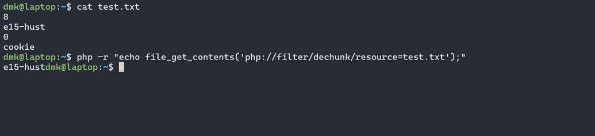
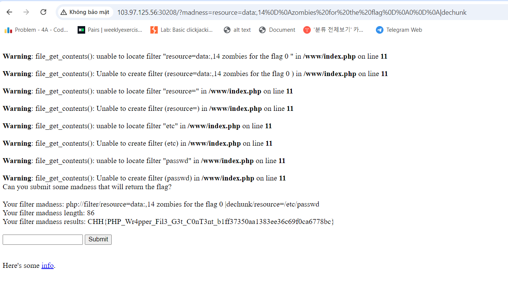

# solution

This challenge is so hard, I think if you can search and have a deep knowledge you can really feel hard to solve it. Here is the link for source code
https://github.com/WolvSec/WolvCTF-2023-Challenges-Public/blob/main/web/filter-madness/index.php

```
<?php
$result = 'no madness submitted yet';
$madness = isset($_GET['madness']) ? $_GET['madness'] : '';
if (strstr($madness, '/')) {
    die('Sorry, no slashes allowed');
}
$file = "php://filter/$madness/resource=/etc/passwd";
if (strlen($file) > 100) {
    die('Sorry, your madness is too long');
}
$result = file_get_contents($file);
if ($result === 'zombies for the flag') {
    $result = file_get_contents('/flag.txt');
}
?>
<div>Can you submit some madness that will return the flag?</div>
<br/>
<div>Your filter madness: <?php echo $file ?></div>
<div>Your filter madness length: <?php echo strlen($file) ?></div>
<div>Your filter madness results: <?php echo $result ?></div>
<br/>
<form method='GET'>
    <input name='madness'></input>
    <button>Submit</button>
</form>
<br/>
<div>Here's some <a href='/info.php'>info</a>.</div>
```

At first glance, it can be understood that it takes your input ( $madness ) to pass into $file and the result of file_get_contents($file) = $result. The difficulty of this problem is how to make **$result === ‘zombies for the flag’\*\* but resource=/etc/passwd .

After a while of searching on google, I found a pretty good writeups: WolvCTF-2023-Challenges-Public/web/filter-madness/solver-for-filter-madness.py at main · WolvSec/WolvCTF-2023-Challenges-Public ·

Basically, this person uses dechunk to remove “/etc/passwd” and at the same time create the returned data that meets the requirements of the problem.

First of all, what is dechunk? dechunk is a method from php://filter wrapper, it is not specifically mentioned in php document but its purpose is to handle chunked transfer encoding 6. Each chunk is divided into 2 parts: chunk length and chunk data.

dechunk is often combined with some other techniques to read files with error-based oracle 3 but in this post I will not go into detail.

Example of using dechunk:
<br>

- The value 8 here is the length (hex) corresponding to the e15-hust data
- The value 0 indicates the end of the data

I will explain more if you're a newbie like me. Dechuck will takes the number of chars (content) corresponding to the sum of that hex numbers by calculating that hex number in decimal form such as **16 hex equal to (1*16^1+6*16^0)=22 in decimal**
<br>

The ‘cookie’ string we added is not written out because when it encounters a chunk with length 0, dechunk will stop (it understands that it is the last chunk and by default thinks that there is no more data). That means we can remove the part behind and at the same time return the correct data we need. Nice, two birds with one stone :))

Now all we have to do is write the payload cleverly, put this in url

```
madness=resource=data:,14%0D%0Azombies%20for%20the%20flag%0D%0A0%0D%0A|dechunk
```

<br>

I will explain more for this payload.

1. Structure: Data **data:** URI is defined according to the following structure

```
data:[<media type>][;base64],<data>
```

When you use this structure, or when you provide resource=data: in your URL, the filter will no longer access the /etc/passwd file. Instead, the **data:** part has been specified as the primary data source. This means that PHP will take the data from the string you provided (specifically, from the chunked data you created).

2. %0D%0A mean \r\n (new line and puts the cursor at the beginning of the line)
3. So what happen: server will dechunk this data

```
14
zombies for the flag
0
```

And result = zombies for the flag and we get the flag
