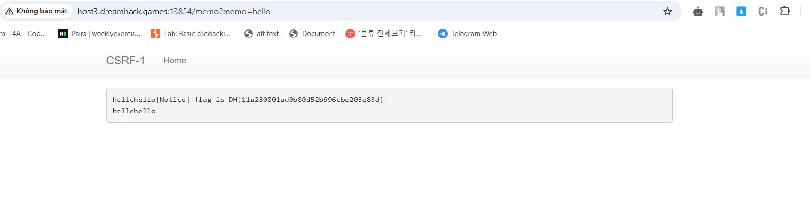

# solution

Let take a look at source code.

```
def read_url(url, cookie={"name": "name", "value": "value"}):
    cookie.update({"domain": "127.0.0.1"})
    try:
        service = Service(executable_path="/chromedriver")
        options = webdriver.ChromeOptions()
        for _ in [
            "headless",
            "window-size=1920x1080",
            "disable-gpu",
            "no-sandbox",
            "disable-dev-shm-usage",
        ]:
            options.add_argument(_)
        driver = webdriver.Chrome(service=service, options=options)
        driver.implicitly_wait(3)
        driver.set_page_load_timeout(3)
        driver.get("http://127.0.0.1:8000/")
        driver.add_cookie(cookie)
        driver.get(url)
    except Exception as e:
        driver.quit()
        print(str(e))
        # return str(e)
        return False
    driver.quit()
    return True


def check_csrf(param, cookie={"name": "name", "value": "value"}):
    url = f"http://127.0.0.1:8000/vuln?param={urllib.parse.quote(param)}"
    return read_url(url, cookie)


@app.route("/")
def index():
    return render_template("index.html")


@app.route("/vuln")
def vuln():
    param = request.args.get("param", "").lower()
    xss_filter = ["frame", "script", "on"]
    for _ in xss_filter:
        param = param.replace(_, "*")
    return param


@app.route("/flag", methods=["GET", "POST"])
def flag():
    if request.method == "GET":
        return render_template("flag.html")
    elif request.method == "POST":
        param = request.form.get("param", "")
        if not check_csrf(param):
            return '<script>alert("wrong??");history.go(-1);</script>'

        return '<script>alert("good");history.go(-1);</script>'


memo_text = ""


@app.route("/memo")
def memo():
    global memo_text
    text = request.args.get("memo", None)
    if text:
        memo_text += text
    return render_template("memo.html", memo=memo_text)


@app.route("/admin/notice_flag")
def admin_notice_flag():
    global memo_text
    if request.remote_addr != "127.0.0.1":
        return "Access Denied"
    if request.args.get("userid", "") != "admin":
        return "Access Denied 2"
    memo_text += f"[Notice] flag is {FLAG}\n"
    return "Ok"
```

Hope you will do that, i just summarize what we do.

1. Put a payload on **/flag** (notice that you can use iframe script on) so we can use img tag to trigger xss with csrf.
2. Simply understand that when we pass the param at /flag, the server will set addr = 127.0.0.1 for us, so we can bypass denied 1. For denied 2, we try using the parameter userid = admin. If we success, **memo_text += f"[Notice] flag is {FLAG}\n"**, just go to **/memo** to achive flag.
3. payload

```

```

4.  <br>
